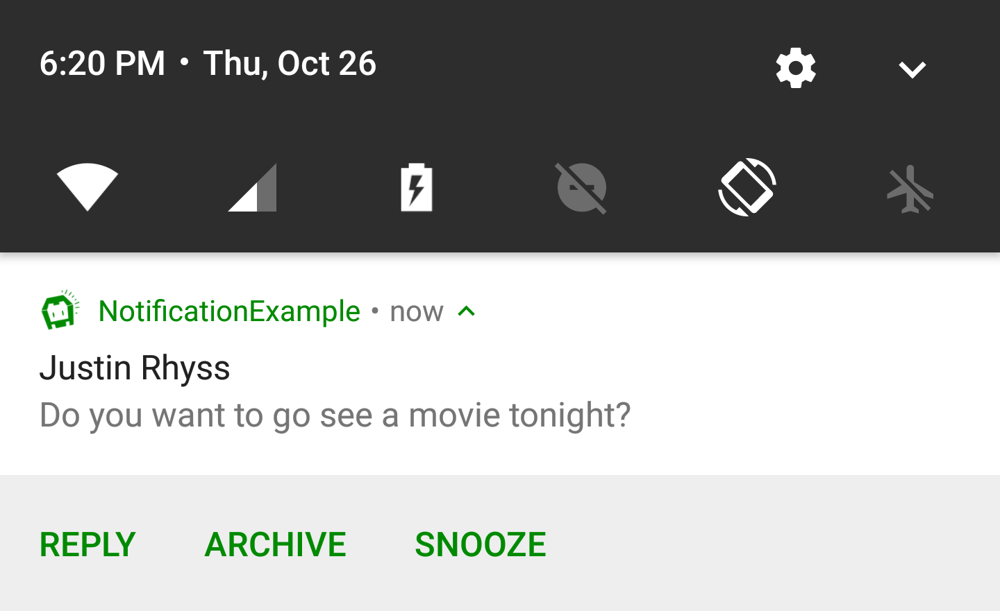
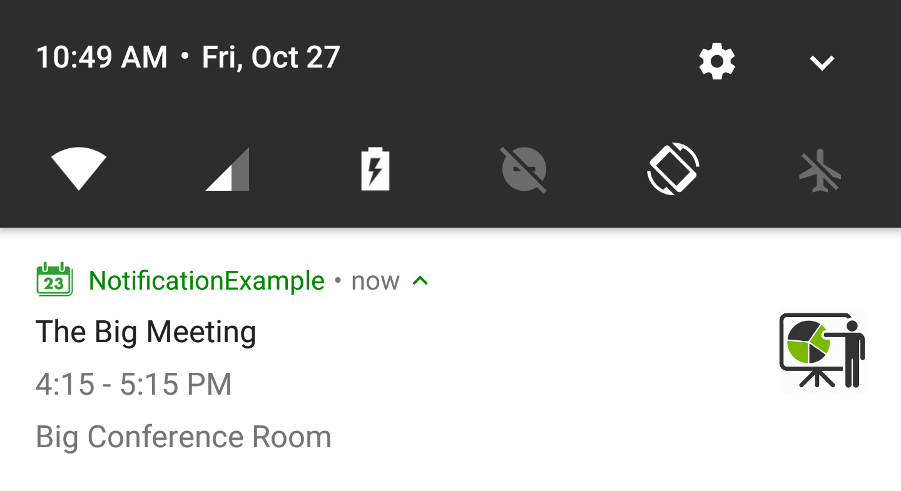
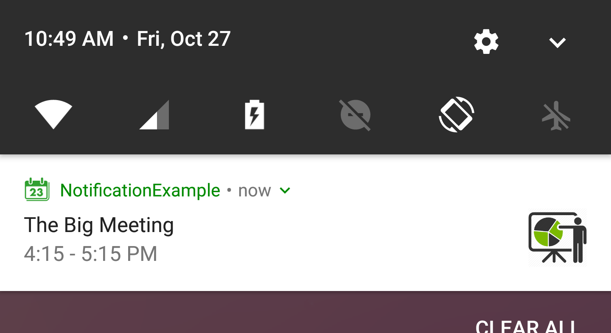
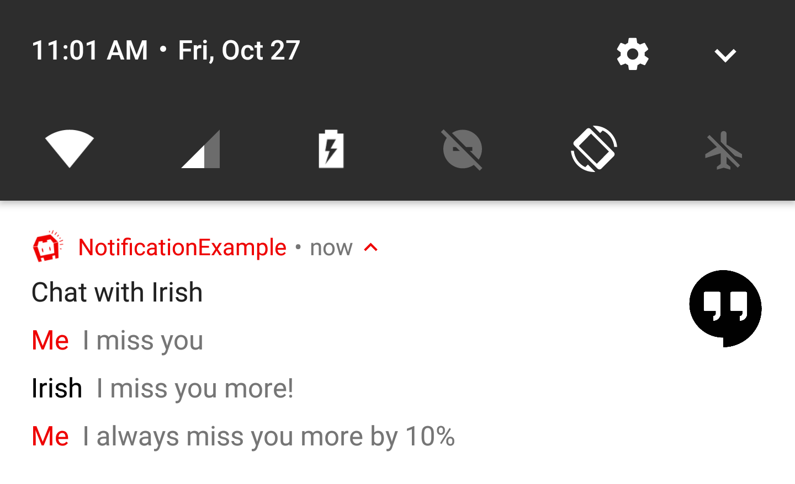
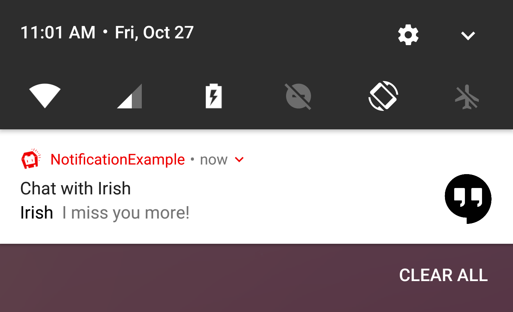
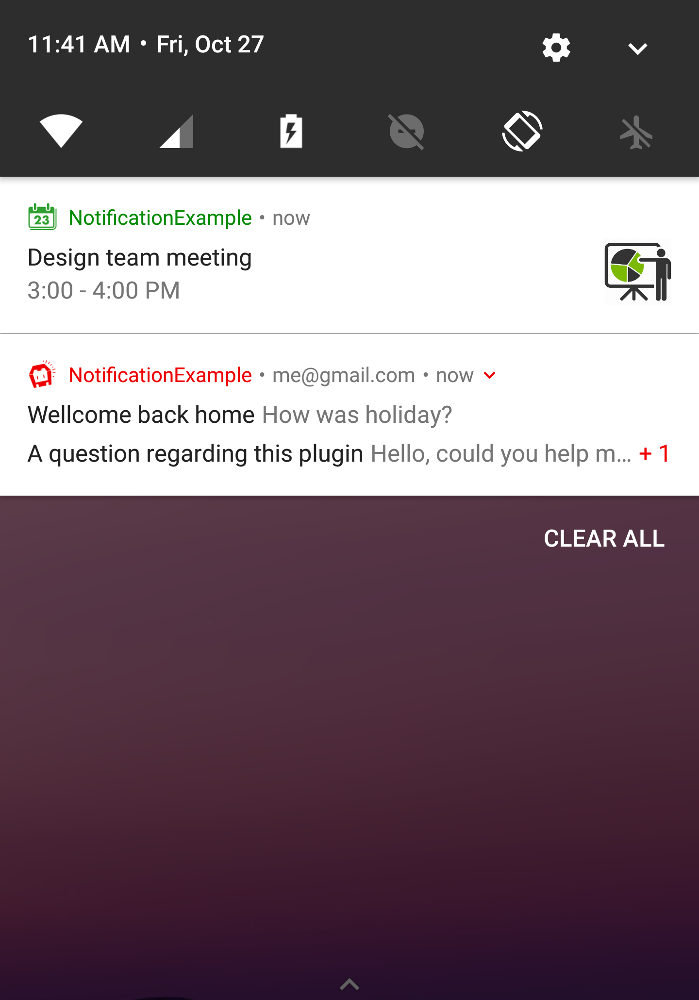
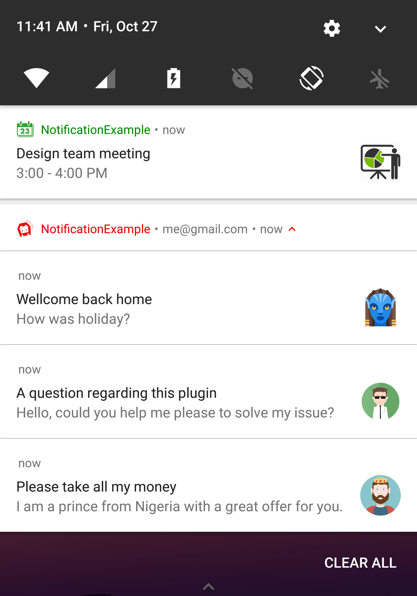

<p align="left"><b><a href="https://github.com/katzer/cordova-plugin-local-notifications/tree/example">SAMPLE APP</a> :point_right:</b></p>

<br>

<p align="center">
    
</p>

<p align="center">
    <a href="https://www.npmjs.com/package/de.appplant.cordova.plugin.local-notification">
        
    </a>
    <a href="https://www.paypal.com/cgi-bin/webscr?cmd=_s-xclick&hosted_button_id=L3HKQCD9UA35A "Donate once-off to this project using Paypal"">
        
    </a>
</p>

<br>

> A notification is a message you display to the user outside of your app's normal UI. When you tell the system to issue a notification, it first appears as an icon in the notification area. To see the details of the notification, the user opens the notification drawer. Both the notification area and the notification drawer are system-controlled areas that the user can view at any time.

<br>

</img>
</img>

### Notification components

- Header area
- Content area
- Action area

### How notifications may be noticed

- Showing a status bar icon
- Appearing on the lock screen
- Playing a sound or vibrating
- Peeking onto the current screen
- Blinking the device's LED

### Supported platforms

- Android
- iOS
- Windows

<br>


## Basics

The plugin creates the object `cordova.plugins.notification.local` and is accessible after *deviceready* has been fired.

```js
document.addEventListener('deviceready', function () {
    // cordova.plugins.notification.local is now available
}, false);
```

Lets schedule a basic notification:

```js
cordova.plugins.notification.local.schedule({
    title: 'My first notification',
    text: 'Thats pretty easy...'
});
```

<p align="center">
    
</p>

Of course its possible to schedule multiple notifications at once:

```js
cordova.plugins.notification.local.schedule([{
    id: 1,
    title: 'My first notification',
    text: 'Thats pretty easy...'
},{
    id: 2,
    title: 'My first notification',
    text: 'Thats pretty easy...'
}]);
```

And to get informed when the user has clicked on it:

```js
cordova.plugins.notification.local.on('click', function (toast, event) {
    console.log(toast.title);
});
```

## Actions

Great so far. Now we add some content and actions:

```js
cordova.plugins.notification.local.schedule({
    title: 'The big survey',
    text: 'Are you a fan of RB Leipzig?',
    attachments: ['file://img/rb-leipzig.jpg'],
    actions: [{
        id: '#he-likes-leipzig',
        title: 'Yes'
    },{
        id: '#he-doesnt',
        title: 'No'
    }]
});
```

<p align="center">
    
    &nbsp;&nbsp;&nbsp;&nbsp;
    
    &nbsp;&nbsp;&nbsp;&nbsp;
    
</p>

To get informed about the users choice:

```js
cordova.plugins.notification.local.on('#he-likes-leipzig', function (toast, event) {
    console.log('Yeah!!!');
});
```

All platforms have built-in support for interactive actions where the user can respond by some input:

```js
cordova.plugins.notification.local.schedule({
    title: 'Justin Rhyss',
    text: 'Do you want to go see a movie tonight?',
    actions: [{
        id: '#reply',
        type: 'input',
        title: 'Reply',
        emptyText: 'Type message',
    }, ... ]
});
```

<p align="center">
    
    &nbsp;&nbsp;&nbsp;&nbsp;
    
</p>

To get informed about the users input:

```js
cordova.plugins.notification.local.on('#reply', function (toast, event) {
    console.log(event.text);
});
```

It is recommended to pre-define action groups rather then specifying them with each new notification of the same type.


```js
cordova.plugins.notification.local.addActionGroup('yes-no', [
    { id: 'yes', title: 'Yes' },
    { id: 'no',  title: 'No'  }
]);
```

Once you have defined an action group, you can reference it when scheduling notifications: 

```js
cordova.plugins.notification.local.schedule({
    title: 'Justin Rhyss',
    text: 'Do you want to go see a movie tonight?',
    actionGroupId: 'yes-no'
});
```

## Triggers

Notifications may trigger immediately or depend on calendar or location.

To trigger at a fix date:

```js
cordova.plugins.notification.local.schedule({
    title: 'Design team meeting',
    text: '3:00 - 4:00 PM',
    trigger: { at: new Date(2017, 10, 27, 15) }
});
```

Or relative from now:

```js
cordova.plugins.notification.local.schedule({
    title: 'Design team meeting',
    trigger: { in: 1, unit: 'hour' }
});
```

Or repeat relative from now:

```js
cordova.plugins.notification.local.schedule({
    title: 'Design team meeting',
    trigger: { every: 'day', count: 5 }
});
```

Or trigger every time the date matches:

```js
cordova.plugins.notification.local.schedule({
    title: 'Happy Birthday!!!',
    trigger: { every: { month: 10, day: 27, hour: 9, minute: 0 } }
});
```

And to get informed about the event triggered:

```js
cordova.plugins.notification.local.on('trigger', function (toast, event) { ... });
```


## Styles

It's possible to split the text into multiple lines:

```js
cordova.plugins.notification.local.schedule({
    title: 'The Big Meeting',
    text: '4:15 - 5:15 PM\nBig Conference Room',
    smallIcon: 'res://calendar',
    icon: 'https://encrypted-tbn0.gstatic.com/images?q=tbn:ANd9GcTzfXKe6Yfjr6rCtR6cMPJB8CqMAYWECDtDqH-eMnerHHuXv9egrw'
});
```

<p align="center">
    
    &nbsp;&nbsp;&nbsp;&nbsp;
    
</p>

The notification may visulate a chat conversation:

```js
cordova.plugins.notification.local.schedule({
    id: 15,
    title: 'Chat with Irish',
    icon: 'http://climberindonesia.com/assets/icon/ionicons-2.0.1/png/512/android-chat.png',
    text: [
        { message: 'I miss you' },
        { person: 'Irish', message: 'I miss you more!' },
        { message: 'I always miss you more by 10%' }
    ]
});
```

<p align="center">
    
    &nbsp;&nbsp;&nbsp;&nbsp;
    
</p>

To add a new message to the existing chat:

```js
cordova.plugins.notification.local.update({
    id: 15,
    text: [{ person: 'Irish', message: 'Bye bye' }]
});
```

You can bundle connected notifications together as a single group:

```js
cordova.plugins.notification.local.schedule([
    { id: 0, title: 'Design team meeting', ... },
    { id: 1, summary: 'me@gmail.com', group: 'email', groupSummary: true },
    { id: 2, title: 'Please take all my money', ... group: 'email' },
    { id: 3, title: 'A question regarding this plugin', ... group: 'email' },
    { id: 4, title: 'Wellcome back home', ... group: 'email' }
]);
```

<p align="center">
    
    &nbsp;&nbsp;&nbsp;&nbsp;
    
</p>


## Installation

The plugin can be installed via [Cordova-CLI][CLI] and is publicly available on [NPM][npm].

Execute from the projects root folder:

    $ cordova plugin add cordova-plugin-local-notification

Or install a specific version:

    $ cordova plugin add cordova-plugin-local-notification@VERSION

Or install the latest head version:

    $ cordova plugin add https://github.com/katzer/cordova-plugin-local-notification.git

Or install from local source:

    $ cordova plugin add cordova-plugin-local-notification --nofetch --searchpath <path>


## Contributing

1. Fork it
2. Create your feature branch (`git checkout -b my-new-feature`)
3. Commit your changes (`git commit -am 'Add some feature'`)
4. Push to the branch (`git push origin my-new-feature`)
5. Create new Pull Request


## License

This software is released under the [Apache 2.0 License][apache2_license].

Made with :yum: from Leipzig

© 2013 [appPlant GmbH][appplant]


[cordova]: https://cordova.apache.org
[CLI]: http://cordova.apache.org/docs/en/edge/guide_cli_index.md.html#The%20Command-line%20Interface
[npm]: https://www.npmjs.com/package/cordova-plugin-local-notification
[apache2_license]: http://opensource.org/licenses/Apache-2.0
[appplant]: http://appplant.de
