<p style="text-align: center;">
    
</p>

<!-- Apache license -->
<a href="https://opensource.org/licenses/Apache-2.0">
    
</a>

# Version 1.2.2

Stable release:
<!--
  GitHub caches the npm badge and changes the url to a cached github url like:
  https://camo.githubusercontent.com/11f744ab82c...
  The GitHub can be cleared with the following bash command:
  curl -X PURGE https://camo.githubusercontent.com/11f744ab82c...
  The browser would have to be cleared also to let the updated badge appear.
-->
[](https://badge.fury.io/js/cordova-plugin-local-notification)

A notification is a message you display to the user outside of your app's normal UI. When you tell the system to issue a notification, it first appears as an icon in the notification area. To see the details of the notification, the user opens the notification drawer. Both the notification area and the notification drawer are system-controlled areas that the user can view at any time.

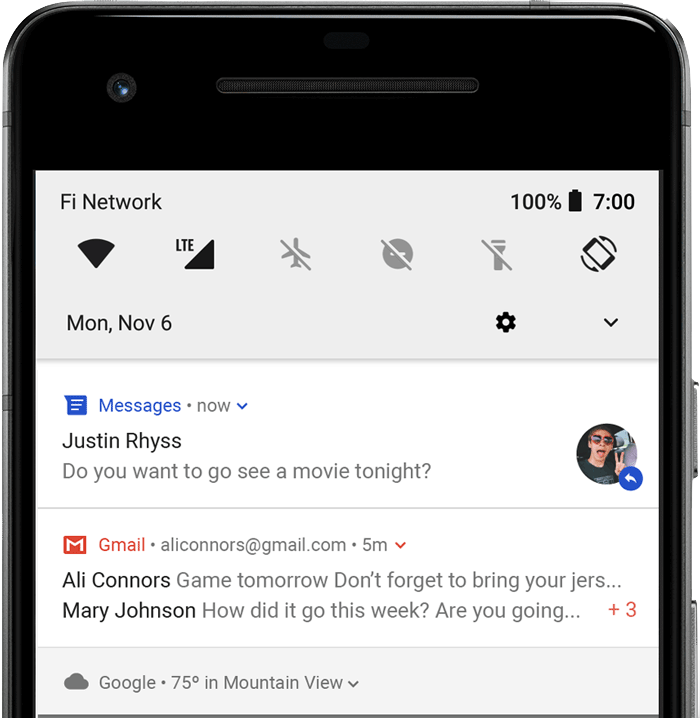

### Notification components

- Header area
- Content area
- Action area

### How notifications may be noticed

- Showing a status bar icon
- Appearing on the lock screen
- Playing a sound or vibrating
- Peeking onto the current screen
- Blinking the device's LED

### Supported platforms

- Android 7.0+ (minimum version by cordova-android 13.0.0) with a minimum WebView Version 60 (Android 8 is shipped with a WebView version 58 and must be updated with Google Play Store before)
- iOS 11.3+ (minimum version by cordova-ios 7.0.0)

### Installation

The plugin can be installed via [Cordova-CLI][CLI] and is publicly available on [NPM][npm].

#### NPM

Execute from the projects root folder:

    $ cordova plugin add cordova-plugin-local-notification

Install a specific version:

    $ cordova plugin add cordova-plugin-local-notification@VERSION

#### Git
Install the latest head version:

    $ cordova plugin add https://github.com/katzer/cordova-plugin-local-notifications.git

Install from a branch:

    $ cordova plugin add https://github.com/katzer/cordova-plugin-local-notifications.git#branch

Install from a tag:

    $ cordova plugin add https://github.com/katzer/cordova-plugin-local-notifications.git#v1.0.0

Install from a specific commit:

    $ cordova plugin add https://github.com/katzer/cordova-plugin-local-notifications.git#5e4f131

#### Local
Install from local source:

    $ cordova plugin add <path> --nofetch --nosave --link

## Upgrade Notice

### Version 0.9.0-beta.3 (13.02.2018)
- Last version which supports `cordova-android` older than `13.0.0` and supports minimum `cordova-android` version `6.0.0` which is Android version `4.1`
- Last version which supports the Windows platform

### Version 1.0.0 (17.08.2024)
- Removed Windows platform
- Support for Android 12-14 and uses AndroidX
- Raised minimum `cordova-android`version from `6.0.0` to `13.0.0`, which raised the minimum Android version from `4.1` `SDK 16` to `7.0` `SDK 24`
- Raised minimum `cordova-ios` version from `4.3.0` to `7.0.0`
- Raised minimum Cordova version from `3.6.0` to `12.0.0`
- Raised minimum `cordova-plugin-device` version from `2.0.0` to `3.0.0`

### Updates in version 1.1.0 (23.12.2024)
- Proper handling of Android channels
- Properties were renamed for the Android platform, see [Changed properties](#changes-since-version-110).

#### Android
The [Default channel](#default-channel) id was changed from `default-channel-id` to `default_channel`. If you upgrade to this version and schedule notifications, there will be two channels from then on, the old one and the new one. You can remove the old one with [deleteChannel](#deletechannel).

#### iOS
[iOSForeground](#property-iosforeground) is `true` by default

### Updates in version 1.1.1

#### Android
The property `vibrate` was renamed to [androidChannelEnableVibration](#property-androidchannelenablevibration).

#### iOS
A notification will be always showed in the notification center like on Android. Happens also if [iOSForeground](#property-iosforeground) is `false`.

### Updates in Version 1.1.4

#### Android
Notifications with an old `trigger.at` date will be shown when you schedule them. Before they were ignored.

### Updates in Version 1.1.8

- Notifications with `trigger.at` date more than 5 seconds in the past will be ignored. iOS did always ignore passed notifications.
- If no [id](#property-id) of a notification is set, it will default to `1` instead of `0`.

## Basics

The plugin creates the object `cordova.plugins.notification.local` and is accessible after the `deviceready` event has been fired.

You can schedule a single notification as follows:

```js
cordova.plugins.notification.local.schedule({
    id: 1,
    title: 'My first notification',
    text: 'Thats pretty easy...'
});
```

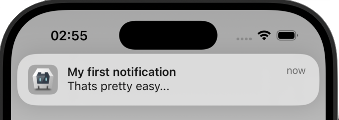

You have always to set an unique ID for every notification. The plugin does not automatically set an ID. If you do not set an ID, it will default to `1`. If you reuse an ID of a previous scheduled notification, the previous one will be canceled.

The plugin allows to schedule multiple notifications at once:

```js
cordova.plugins.notification.local.schedule([
    {
        id: 1,
        title: 'My first notification'
    },
    {
        id: 2,
        title: 'My second notification'
    }
]);
```

## Notification Limits
On each platform are limits about how much notifications can be scheduled:

- iOS: 64
- Android: 500

Repeating notifications count as 1 notification.

## Properties
A notification does have a set of configurable properties. See [all properties](#properties-1).

## Permissions
On iOS and Android 13+ permissions must be requested from the user before notifications can be posted. This is done automatically, when scheduling a notification. If you want do it manually, you can use [requestPermission](#requestpermission). Please keep in mind, that the user can still change the permission later in the system. If you want to check, if you have still the permission to post notifications, use [hasPermission](#haspermission).

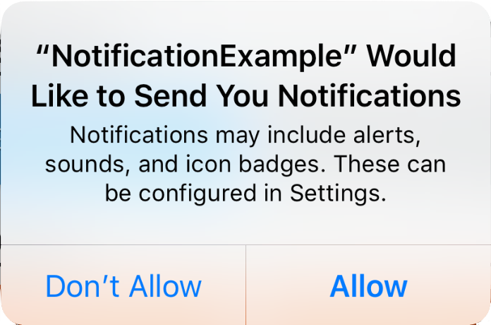


On Android, the permissions must be requested since Android 13. In earlier versions no permissions must be granted.

## Android specials

### Notification channels
Since Android 8 notification channels must be created to post noitifications. A [default channel](#default-channel) will be created for you, if you do not create one. You can also create your own channel by [createChannel](#createchannel) or when [scheduling a notification](#create-channel-by-posting-a-notification). For deleting a channel use [deleteChannel](#deletechannel).

### Inexact alarms since Android 12
Since Android 12 alarms will be scheduled inexact by default. On Android 12 (API level 31) and higher, the system invokes the alarm within one hour of the supplied trigger time, unless any battery-saving restrictions are in effect such as battery saver or Doze. Most apps can schedule tasks and events using inexact alarms to complete several common use cases. If your app's core functionality depends on a precisely-timed alarm — such as for an alarm clock app or a calendar app — then it's OK to use an exact alarm instead.

See [Schedule exact alarms](#android-schedule-exact-alarms), if you want use exact alarms.

See [Android documentation](https://developer.android.com/develop/background-work/services/alarms/schedule) for more information.

### App hibernation / App unused
If your app runs on Android 12 and newer and the user doesn't interact with your app for 3 months, the system places your app in a hibernation state which will cancel all pending notifications and revokes permissions. When the user interacts with your app again, the app exits hibernation and the notifications will be re-scheduled. It doesn't count as app usage if the user dismisses a notification. If the app is hibernated, the user will get informed about it:


The documentation says that permissions are also revoked, but testing the hibernation behavior on an Android 15 emulator showed, that the app keeps the permission to post notifications.

#### Notes
- Android introduced this behavior in Android 11 and additionally backported this to Android 6 to 10 through the Google Play Store but only the permissions are revoked and not the pending notifications. Because permissions are only needed since Android 13, this does not affect this plugin. Since Android 12 notifications are also canceled besides revoking the permissions.
- You can manually test the hibernation behavior, see [App hibernation > Manually invoke hibernation behavior](https://developer.android.com/topic/performance/app-hibernation#manually-invoke).
- To see a complete list, what counts as app usage and what not, see [App hibernation > App usage](https://developer.android.com/topic/performance/app-hibernation#app-usage).
- 3 months are based on executing `adb shell device_config get permissions \ auto_revoke_unused_threshold_millis2` which will return `7776000000` milliseconds on an Android 15 Emulator which are nearly 3 months (~2.96 months).

#### Manage App hibernation

You can get the status of the setting by calling [getUnusedAppRestrictionsStatus](#getunusedapprestrictionsstatus). To redirect the user to the setting, call [openManageUnusedAppRestrictions](#openmanageunusedapprestrictions). Before opening the setting, you can inform the user about this behavior and explain which setting he has to deactivate. When opening the settings, the system will not scroll to the right entry and the setting is named differently on different Android versions:

Sample Android 12:

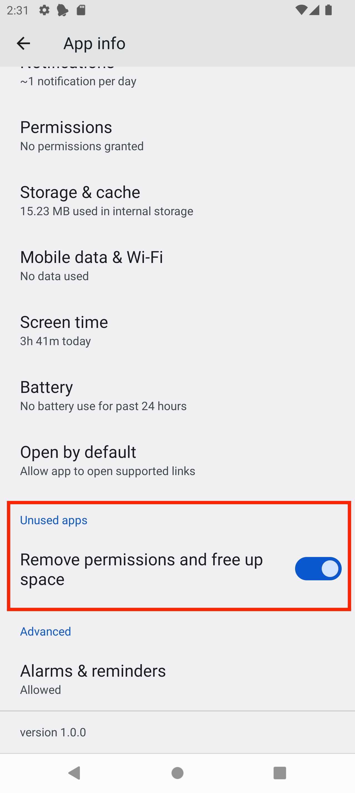

On other Android versions it is named differently:

Android 13/14:

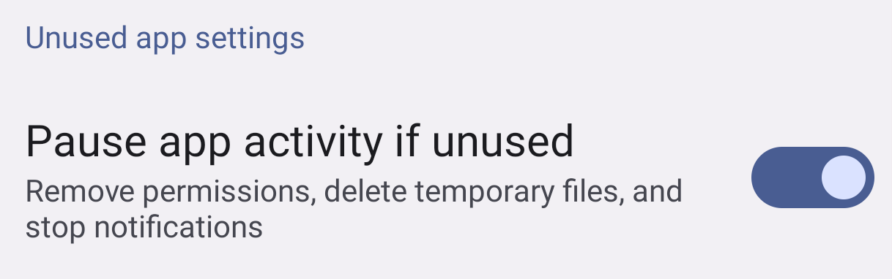

Android 15:


### Doze and Standby

Android has two power-saving features that extend battery life for users by managing how apps behave when a device isn't connected to a power source: Doze and App Standby. Doze reduces battery consumption by deferring background CPU and network activity for apps when the device is unused for long periods of time. App Standby defers background network activity for apps with no recent user activity.

To fire notifications when the device is in doze mode, you can schedule notifications with the property [androidAllowWhileIdle](#property-androidallowwhileidle).

App Standby does not affect you when showing a notification.

You can read everything about it in the [Android documentatation](https://developer.android.com/training/monitoring-device-state/doze-standby).

### Alarm rescheduling

#### App Update
Android removes all alarms when the app is updated. The plugin reschedules all alarms by a [BroadcastReceiver](https://developer.android.com/develop/background-work/background-tasks/broadcasts) listening to [ACTION_MY_PACKAGE_REPLACED](https://developer.android.com/reference/android/content/Intent#ACTION_MY_PACKAGE_REPLACED).

#### Device reboot
Android removes all alarms when the device reboots. The plugin reschedules all alarms by a [BroadcastReceiver](https://developer.android.com/develop/background-work/background-tasks/broadcasts) listening to [ACTION_BOOT_COMPLETED](https://developer.android.com/reference/android/content/Intent#ACTION_BOOT_COMPLETED), but only after the device has been unlocked.

#### User grants exact alarms
If you use [SCHEDULE_EXACT_ALARM](#exact-alarms-user-grants-permission) for scheduling exact alarms and the user permits the permission in the "Alarms & Reminders", inexact alarms will be rescheduled as exact alarms. This is done by a [BroadcastReceiver](https://developer.android.com/develop/background-work/background-tasks/broadcasts) listening to [ACTION_SCHEDULE_EXACT_ALARM_PERMISSION_STATE_CHANGED](https://developer.android.com/reference/android/app/AlarmManager#ACTION_SCHEDULE_EXACT_ALARM_PERMISSION_STATE_CHANGED). This action will not be called if the user revokes the permission. All exact alarms will be canceled then.

[](README.md#android-15-alarms-get-canceled-on-force-stop)
#### Android 15: Alarms get canceled on `Force stop`
Since Android 15 all pending alarms will get canceled if the user force stops an app, this is a change by Google, see https://developer.android.com/about/versions/15/behavior-changes-all#enhanced-stop-states. The alarms will be re-registered, if the user starts the app again. If the user clears the app from the app stack the alarms will not get canceled.

Keep in mind, that force stopping is only known by advised users and if they do it, they have a reason to do this and they should be aware, that the app will no longer function correctly as the System also states when clicking on `Force stop` by showing an alert with the message `If you force stop an app, it may misbehave.`

## Actions

You can add actions, which can be a button or an input to a notification. Before you can use them you have to pre-define them:

```javascript
cordova.plugins.notification.local.addActions('YES_NO_CATEGORY', [
    {
        id: 'YES_ACTION',
        title: 'Yes'
    },
    {
        id: 'NO_ACTION',
        title: 'No'
    }
]);
```

Then you have to assign the defined actions when scheduling a notification:

```javascript
cordova.plugins.notification.local.schedule({
    id: 1,
    title: 'Justin Rhyss',
    text: 'Do you want to go see a movie tonight?',
    actions: 'YES_NO_CATEGORY'
});
```

<p style="text-align: center;">
    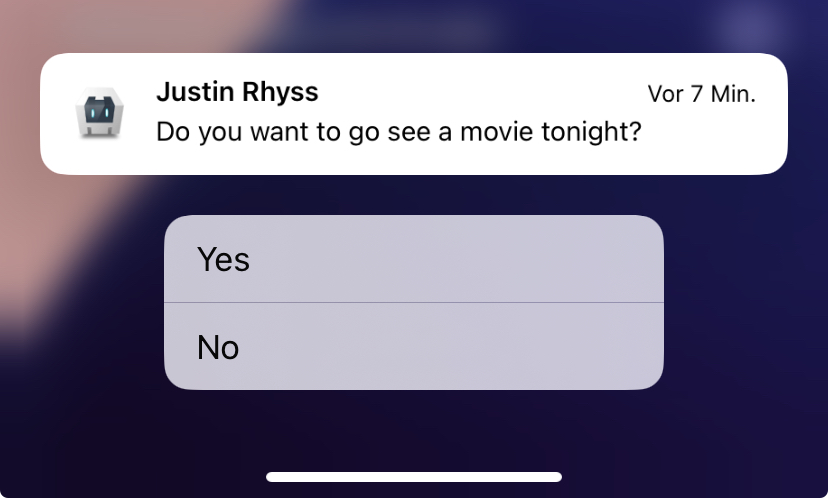
    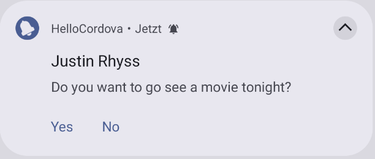
</p>

On iOS the actions are not visible by default. You have to long press on the notification to see them.

Icons on action buttons are not possible. Android had supported it, but stopped this in [Android 7](https://developer.android.com/reference/android/app/Notification.Action.Builder#Builder(int,%20java.lang.CharSequence,%20android.app.PendingIntent)).

The plugin knows two types of actions `button` and `input`. If you do not specifiy a type, an action is by default a button.

### Input

You can define an action as input.

Register actions:

```javascript
cordova.plugins.notification.local.addActions('REPLY_NO_CATEGORY', [
    {
        id: 'REPLY_ACTION',
        type: 'input',
        title: 'Reply',
        emptyText: 'Type message'
    },
    {
        id: 'NO_ACTION',
        title: 'No'
    }
]);
```

Schedule with registered actions:

```javascript
cordova.plugins.notification.local.schedule({
    id: 1,
    title: 'Justin Rhyss',
    text: 'Do you want to go see a movie tonight?',
    actions: 'REPLY_NO_CATEGORY'
});
```

| iOS          | Android      |
| :----------- | :----------- |
| 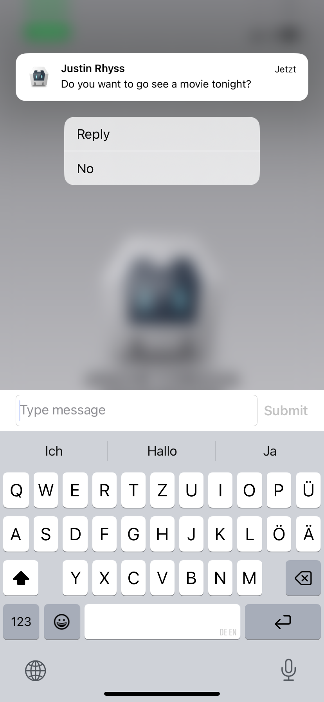 | 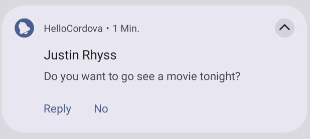<br>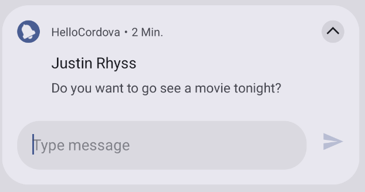 |

OS native documentation:
- Android: https://developer.android.com/develop/ui/views/notifications/build-notification#reply-action

### Handle action events
You can subscribe to an action event.

Example:

```javascript
cordova.plugins.notification.local.addActions('YES_NO_CATEGORY', [
    { id: 'YES_ACTION', title: 'Yes' },
    { id: 'NO_ACTION',  title: 'No'  }
]);
```

You have to subscribe to the action id:

```javascript
cordova.plugins.notification.local.on('YES_ACTION', (notification, eopts) => {
    // Your code
});
```

To unsubcribe see [Events](#events).

### Action properties

Actions do have a set of configurable properties. Not all of them are supported across all platforms.

| Property     | Type         | Android | iOS |
| :----------- | :----------- | :------ | :-- |
| id           | button+input | x       | x   |
| title        | button+input | x       | x   |
| launch       | button+input | x       | x   |
| ui           | button+input |         | x   |
| needsAuth    | button+input |         | x   |
| icon         | button+input | x       |     |
| emptyText    | input        | x       | x   |
| submitTitle  | input        |         | x   |
| editable     | input        | x       |     |
| choices      | input        | x       |     |
| defaultValue | input        |         |     |


## Triggers

Notifications may trigger immediately or depend on calendar or location.

### Fixed date
Trigger at a fixed date:

```js
cordova.plugins.notification.local.schedule({
    id: 1,
    title: 'Design team meeting',
    text: '3:00 - 4:00 PM',
    trigger: { at: new Date(2017, 10, 27, 15) }
});
```

| Property      | Type    | Value            | Android | iOS |
| :------------ | :------ | :--------------- | :------ | :-- |
| at            | Date    |                  | x       | x   |

### Relative
Relative from now:

```js
cordova.plugins.notification.local.schedule({
    id: 1,
    title: 'Design team meeting',
    trigger: { in: 1, unit: 'hour' }
});
```

| Property      | Type    | Value            | Android | iOS |
| :------------ | :------ | :--------------- | :------ | :-- |
| in            | Int     |                  | x       | x   |
| unit          | String  | `second`, `minute`, `hour`, `day`, `week`, `month`, `quarter`, `year` | x       | x   |

### Repeating

Repeat relative from now:

```js
cordova.plugins.notification.local.schedule({
    id: 1,
    title: 'Design team meeting',
    trigger: { every: 'day', count: 5 } // count is only supported by Android
});
```

| Property      | Type    | Value            | Android | iOS | Note |
| :------------ | :------ | :--------------- | :------ | :-- | :--- |
| before        | Date    |                  | x       |     | |
| firstAt       | Date    |                  | x       |     | |
| count         | Int     |                  | x       |     |      |
| every         | String  | `minute`, `hour`, `day`, `week`, `month`, `quarter` , `year` | x       | x   | |

Trigger every time the date matches:

```js
cordova.plugins.notification.local.schedule({
    id: 1,
    title: 'Happy Birthday!!!',
    trigger: { every: { month: 10, day: 27, hour: 9, minute: 0 } }
});
```

| Property      | Type    | Value            | Android | iOS | Note |
| :------------ | :------ | :--------------- | :------ | :-- | :--- |
| before        | Date    |                  | x       |     | |
| after         | Date    |                  | x       |     | |
| count         | Int     |                  | x       |     |      |
| every         | Object  | `minute`, `hour`, `day`, `weekday`, `weekdayOrdinal` , `week` , `weekOfMonth`, `month`, `quarter`   | x       | x   | |

### Location based
 iOS only

To trigger when the user enters a region:

```js
cordova.plugins.notification.local.schedule({
    id: 1,
    title: 'Welcome to our office',
    trigger: {
        type: 'location',
        center: [x, y],
        radius: 15,
        notifyOnEntry: true
    }
});
```

| Property      | Type    | Value            | Android | iOS | Note |
| :------------ | :------ | :--------------- | :------ | :-- | :--- |
| center        | Array   | `[lat, long]`    |         | x   |      |
| radius        | Int     |                  |         | x   |      |
| notifyOnEntry | Boolean |                  |         | x   |      |
| notifyOnExit  | Boolean |                  |         | x   |      |
| single        | Boolean |                  |         | x   |      |

## Progress
 Android only

Notifications can include an animated progress indicator that shows users the status of an ongoing operation.

```js
cordova.plugins.notification.local.schedule({
    id: 1,
    title: 'Sync in progress',
    text: 'Copied 2 of 10 files',
    androidProgressBar: {
        value: 20, // Default 0
        maxValue: 100, // Default 100
        indeterminate: false // Default false
    }
});
```

<p style="text-align: center;">
    
</p>

Calls [NotificationCompat.Builder#setProgress(int,int,boolean)](https://developer.android.com/reference/androidx/core/app/NotificationCompat.Builder#setProgress(int,int,boolean))

### Indeterminate Progress

Use indeterminate mode for the progress bar when you do not know how long an operation will take. It shows a cyclic animation without a specific amount of progress indicated.

See [ProgressBar#indeterminate-progress](https://developer.android.com/reference/android/widget/ProgressBar.html#indeterminate-progress)

### Determinate Progress

Use determinate mode for the progress bar when you want to show that a specific quantity of progress has occurred. For example, the percent remaining of a file being retrieved, the amount records in a batch written to database, or the percent remaining of an audio file that is playing.

See [ProgressBar#determinate-progress](https://developer.android.com/reference/android/widget/ProgressBar.html#determinate-progress)

## Patterns
 Android only

Split the text by line breaks if the message comes from a single person and just too long to show in a single line.

```js
cordova.plugins.notification.local.schedule({
    id: 1,
    title: 'The Big Meeting',
    text: '4:15 - 5:15 PM\nBig Conference Room',
    androidSmallIcon: 'res://ic_menu_my_calendar',
    androidLargeIcon: 'res://large_icon'
});
```

<p style="text-align: center;">
    
</p>

## Summarizing
 Android only

Instead of displaying multiple notifications, you can create one notification that summarizes them all.

```js
cordova.plugins.notification.local.schedule({
    id: 15,
    title: 'Chat with Irish',
    androidLargeIcon: 'res://large_icon',
    androidMessages: [
        { person: 'Me', message: 'I miss you' },
        { person: 'Irish', message: 'I miss you more!' },
        { person: 'Me', message: 'I always miss you more by 10%' }
    ]
});
```

<p style="text-align: center;">
    
</p>

To add a new message to the existing chat:

```js
cordova.plugins.notification.local.update({
    id: 15,
    androidMessages: [{ person: 'Irish', message: 'Bye bye' }]
});
```

For displaying the messages, [NotificationCompat.MessagingStyle](https://developer.android.com/reference/androidx/core/app/NotificationCompat.MessagingStyle) will be used.

### Properties for `androidMessages`
```javascript
androidMessags: [
    {
        message: "The message", // Default is `null`
        date: 1234567890, // Timestamp in milliseconds for e.g. by Date.getTime(), default is System.currentTimeMillis()
        person: "Michael", // Default is `null`
        personIcon: "www/personIcon.png" // Default is `null`
    }
]
```

#### Property `personIcon`
Will be drawn as a circle icon.

Possible values:
- `res://personIcon.png` - Resource from the app bundle, see [documentation](#resource-pattern-res)
- `www/personIcon.png` - Resource from the `www` folder, see [documentation](#resource-pattern-www)
- `shared://personIcon.png` - Resource from the shared folder, see [documentation](#resource-pattern-shared)

## Grouping
 Android only

Your app can present multiple notifications as a single group:

- A parent notification displays a summary of its child notifications.
- The child notifications are presented without duplicate header information.

```js
cordova.plugins.notification.local.schedule([
    {
        id: 1,
        title: 'Design team meeting',
        ...
    },
    {
        id: 2,
        androidSummary: 'me@gmail.com',
        androidGroup: 'email',
        androidGroupSummary: true
    },
    {
        id: 3,
        title: 'Please take all my money',
        ...,
        androidGroup: 'email'
    },
    {
        id: 4,
        title: 'A question regarding this plugin',
        ...,
        androidGroup: 'email'
    },
    {
        id: 5,
        title: 'Wellcome back home',
        ...,
        androidGroup: 'email'
    }
]);
```

<p style="text-align: center;">
    
</p>

## Android channels

### Default channel
The following settings will be used for the default Android channel.

```javascript
{
    androidChannelId: "default_channel",
    androidChannelName: "Default channel",
    androidChannelImportance: "IMPORTANCE_DEFAULT"
}
```

You can change the defaults by calling [setDefaults](#setdefaults) or you can overwrite them, when scheduling a notification or [creating a channel](#createchannel).

The default channel id was changed in version 1.1.0 from `default-channel-id` to `default_channel`.

### Create channel by posting a notification
A channel can be created directly when posting a notification:

```javascript
cordova.plugins.notification.local.schedule({
    id: 1,
    title: 'My first notification',
    androidChannelId: "my_channel_01",
    androidChannelName: "My Channel Name"
});
```

If you omit some channel properties the [default channel properties](#default-channel) will be used.

## Android: Schedule exact alarms
Since Android 12 notifications will be scheduled inexact by default. On Android 12 (API level 31) and higher, the system invokes the alarm within one hour of the supplied trigger time, unless any battery-saving restrictions are in effect such as battery saver or Doze. Most apps can schedule tasks and events using inexact alarms to complete several common use cases. If your app's core functionality depends on a precisely-timed alarm — such as for an alarm clock app or a calendar app — then it's OK to use an exact alarm instead.

See [Android documentation](https://developer.android.com/develop/background-work/services/alarms/schedule) for more information.

You have two options, to schedule exact alarms.

### Exact alarms: User grants permission
You must add the [SCHEDULE_EXACT_ALARM](https://developer.android.com/reference/android/Manifest.permission#SCHEDULE_EXACT_ALARM) permission to `AndroidManifest.xml`. You can do this with your `config.xml`.

First add the Android xml namespace to your `widget` tag:

```xml
<widget ... xmlns:android="http://schemas.android.com/apk/res/android">
````

Then add the following [config-file](https://cordova.apache.org/docs/en/12.x/plugin_ref/spec.html#config-file) declaration to your `config.xml`:

```xml
<config-file target="AndroidManifest.xml" parent="/manifest">
    <uses-permission android:name="android.permission.SCHEDULE_EXACT_ALARM" />
</config-file>
```

This tells Android that your app wants to have the permission to schedule exact alarms.

|      |      |
| :--- | :--- |
| 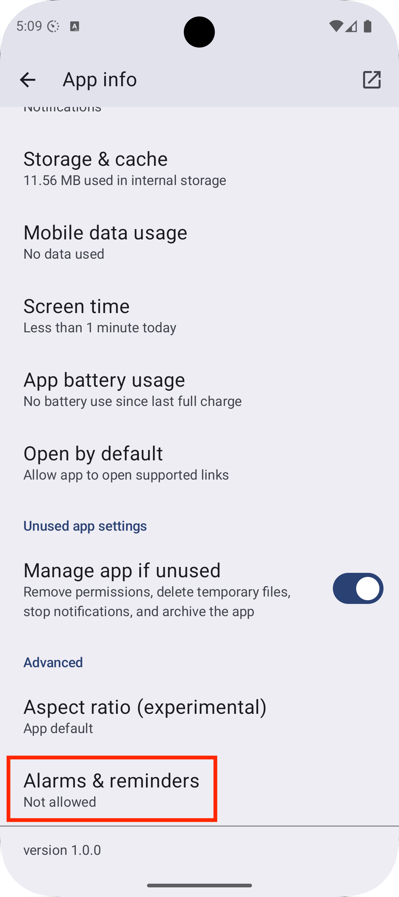 | After declaring `SCHEDULE_EXACT_ALARM` as permission, your app have a new entry in the app settings called `Alarms & reminders`, where the user can enable/disable exact alarms. |
| 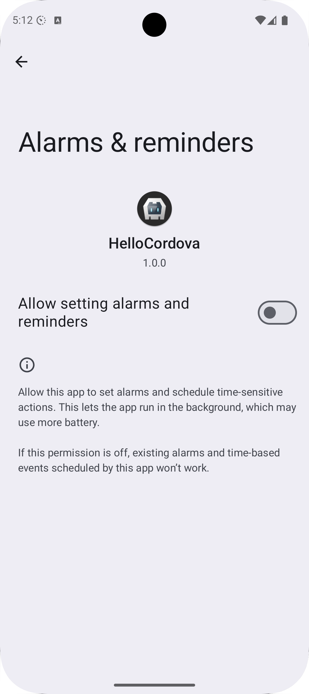 | Clicking on this entry will open the setting to enable/disable exact alarms. This screen will also been shown if you call [openAlarmSettings](#openalarmsettings) |

On Android 12 `SCHEDULE_EXACT_ALARM` is pre-granted. On Android 13 and newer the user has to permit this in the "Alarms & Reminders" setting, which you can open by [openAlarmSettings](#openalarmsettings). You can use the [resume](https://cordova.apache.org/docs/en/12.x/cordova/events/events.html#resume) event of Cordova to check if exact alarms are permitted by [canScheduleExactAlarms](#canscheduleexactalarms). If you have already posted inexact alarms, before the user granted the exact alarm permission, inexact alarms will be automatically rescheduled by this plugin as exact alarms. The downside is, when the user revokes the exact alarm permission, your app will be killed and all exact alarms will be canceled without rescheduling them as inexact alarms. You have to reschedule them the next time the user starts your app. You can read everything about it in the [Android documentation](https://developer.android.com/about/versions/14/changes/schedule-exact-alarms).

### Exact alarms: Define your app as a Calender or Alarm Clock app
This is a very special case you should think about. When you declare your app as a calendar or alarm clock app, the app have to fullfill the requirements and must be approved by Google in the Play Store. Google could remove the app from the store if the app is found to be misusing the permission.

Calendar or alarm clock apps need to send calendar reminders, wake-up alarms, or alerts when the app is no longer running. These apps can request the [USE_EXACT_ALARM](https://developer.android.com/reference/android/Manifest.permission#USE_EXACT_ALARM) permission. The `USE_EXACT_ALARM` permission will be granted on install, and apps holding this permission will be able to schedule exact alarms just like apps with the `SCHEDULE_EXACT_ALARM` permission. The advantage is, that this permission can't be revoked by the user.

To declare the `USE_EXACT_ALARM` permission in the `AndroidManifest.xml`, you can do this with your `config.xml`.

First add the Android xml namespace to your `widget` tag:

```xml
<widget ... xmlns:android="http://schemas.android.com/apk/res/android">
````

Then add the following [config-file](https://cordova.apache.org/docs/en/12.x/plugin_ref/spec.html#config-file) declaration to your `config.xml`:

```xml
<config-file target="AndroidManifest.xml" parent="/manifest">
    <uses-permission android:name="android.permission.SCHEDULE_EXACT_ALARM" android:maxSdkVersion="32" />
    <uses-permission android:name="android.permission.USE_EXACT_ALARM" />
</config-file>
```

The permission `SCHEDULE_EXACT_ALARM` must be decared to be backward compatible with Android 12. The is why the permission is limited by `android:maxSdkVersion="32"`, see [StackOverflow](https://stackoverflow.com/questions/73972021/android-permission-schedule-exact-alarm-required-with-use-exact-alarm-for-alarm) or the documentation of [USE_EXACT_ALARM](https://developer.android.com/reference/android/Manifest.permission#USE_EXACT_ALARM).

The permission `USE_EXACT_ALARM` exists since Android 13 and will be used from then on.

## Events

The following events are supported: `add`, `trigger`, `click`, `clear`, `cancel`, `update`, `clearall` and `cancelall` and [action events](#handle-action-events).

```js
cordova.plugins.notification.local.on(event, callback, scope);
```

To unsubscribe from events:

```js
cordova.plugins.notification.local.un(event, callback, scope);
```

__Note:__ You have to provide the exact same callback to `cordova.plugins.notification.local.un` as you provided to `cordova.plugins.notification.local.on` to make unsubscribing work.
Hence you should define your callback as a separate function, not inline. If you want to use `this` inside of your callback, you also have to provide `this` as `scope` to `cordova.plugins.notification.local.on`.

### Fire manually

Not an official interface, however its possible to manually fire events.

```js
cordova.plugins.notification.local.core.fireEvent(event, args);
```

## Launch Details

Check the `launchDetails` to find out if the app was launched by clicking on a notification.

```js
document.addEventListener('deviceready', function () {
    console.log(cordova.plugins.notification.local.launchDetails);
}, false);
```

It might be possible that the underlying framework like __Ionic__ is not compatible with the launch process defined by cordova. With the result that the plugin fires the click event on app start before the app is able to listen for the events.

Therefore its possible to fire the queued events manually by defining a global variable.

```js
window.skipLocalNotificationReady = true
```

Once the app and Ionic is ready, you can fire the queued events manually.

```js
cordova.plugins.notification.local.fireQueuedEvents();
```

## Methods

All methods work asynchronous and accept callback methods.

Note: This list has still to be documented.


| Method                         | Android | iOS | Comment                   |
| :------------------------------| :-------| :-- | :------------------------ |
| addActions                     | x       | x   | Defines some actions in a group to re-use them. See [Actions](#actions). |
| cancel                         | x       | x   |                           |
| cancelAll                      | x       | x   |                           |
| [canScheduleExactAlarms](#canscheduleexactalarms) | x       | -   | Checks if exact alarms are permitted. Since Android 13 inexact alarms are permitted by default. |
| clear                          | x       | x   | On Android, it clears a already posted notification from the statusbar. |
| clearAll                       | x       | x   |                           |
| [createChannel](#createchannel) | x       | -   | Creates a channel for Android to post notifications on. |
| [deleteChannel](#deletechannel) | x       | -   | Delete a channel by an id. |
| fireQueuedEvents               | x       | x   | Fire queued events once the device is ready and all listeners are registered. This is done automatically, when `deviceready` is fired. Calls the Plugin with a `ready` action. |
| get                            |         |     |                           |
| getAll                         |         |     |                           |
| getDefaults                    | x       | x   | Gets the default for notification properties. See [getDefaults](#getdefaults) |
| getIds                         |         |     |                           |
| getScheduled                   |         |     |                           |
| getScheduledIds                |         |     |                           |
| getTriggered                   |         |     |                           |
| getTriggeredIds                |         |     |                           |
| getType                        |         |     |                           |
| [getUnusedAppRestrictionsStatus](#getUnusedAppRestrictionsStatus) | x       | -   | Gets the status of the unused app restrictions status |
| hasActions                     | x       | x   | Checks if an action group exists by id like `hasActions('YES_NO_CATEGORY', (hasActions) => {}, this)`                       |
| [hasPermission](#hasPermission) | x       | x   | Checks if the app has permission to post notifications. |
| [iOSClearBadge](#iosclearbadge) | -       | x   | Clears the badge          |
| isPresent                      |         |     |                           |
| isScheduled                    |         |     |                           |
| isTriggered                    |         |     |                           |
| on                             | x       | x   | Listen to an [Event](#events) |
| [openAlarmSettings](#openalarmsettings) | x       | -   | Supported since Android 12. Opens the "Alarms & Reminders"-settings, where the user can manually enable exact alarms. |
| [openManageUnusedAppRestrictions](#openManageUnusedAppRestrictions) | x       | -   | Opens the unused app restriction settings directly in the app. |
| [openNotificationSettings](#opennotificationsettings) | x       | (x) | Opens the notifications settings since Android 8. On iOS it opens the app settings. |
| removeActions                  |  x      | x   | Removes actions by a group id like `removeActions('YES_NO_CATEGORY', () => {}, this)` which were previously created by `addActions` |
| [requestPermission](#requestpermission) | x       | x   | Request permission to post notifications. This is called automatically when scheduling notifications. |
| schedule                       | x       | x    | Schedules a single notification or multiple notifications. Accepts an object or an Array. |
| [setDefaults](#setdefaults)    | x       | x   | Overwrites default values of notifications. Gets the default for notification properties. |
| un                             | x       | x   | Unlisten to an [Event](#events) |
| update                         | x       | x  | Updates a single notification or multiple notifications. The notification id has to be set to update a notification. Accepts an obect or an Array. |

### canScheduleExactAlarms
 Android only

Checks if the user has enabled the "Alarms & Reminders"-setting. If not, the notificiatons will be scheduled inexact, which is still ok and will only be delayed by some minutes.
- On Android 11 and older, this method will always return `true` in the `successCallback`.
- On Android 12 the permission is granted by default
- On Android 13 and newer, the permission is not granted by default and have to be explicitly enabled by the user.

### createChannel
 Android only

Creates a channel, if it not already exists. A channel is not changeable, after it is created. This is a restriction by Android.
If a notification does not specify a [androidChannelId](#property-androidchannelid) a [default channel](#default-channel) will be used.

For setting the channel, use [androidChannelId](#property-androidchannelid) when scheduling a notification.

Overview of all properties for a channel:

```js
cordova.plugins.notification.local.createChannel({
    androidChannelId: "my_channel_01", // string, to separate something in the id, use "_" instead of "-"
    androidChannelName: "My Channel Name", // string, defaults to "Default Channel"
    androidChannelDescription: "Description of channel", // string (optional)
    androidChannelImportance: "IMPORTANCE_DEFAULT", // string (optional)
    androidChannelEnableLights: true, // boolean (optional), default is false
    androidChannelEnableVibration: true, // boolean (optional), default is false
    sound: 'www/audio/ring.mp3', // string (optional)
    androidChannelSoundUsage: 5 // int (optional), default is USAGE_NOTIFICATION
  }, successCallback, this)
```

Property documentation:
- [androidChannelId](#property-androidchannelid)
- [androidChannelImportance](#property-androidchannelimportance)
- [androidChannelEnableLights](#property-androidchannelenablelights)
- [androidChannelEnableVibration](#property-androidchannelenablevibration)
- [sound](#property-sound)
- [androidChannelSoundUsage](#property-androidchannelsoundusage)

### deleteChannel
 Android only

Deletes a Android channel.

Example:

```javascript
cordova.plugins.notification.local.deleteChannel("my_channel_id", successCallback, this)
```

These will delete all associated notificiations for this channel. If you create a new channel with the same id, the deleted channel will be un-deleted with all of the same settings it had before it was deleted, see [NotificationManagerCompat.deleteNotificationChannel](https://developer.android.com/reference/androidx/core/app/NotificationManagerCompat#deleteNotificationChannel(java.lang.String))

### getDefaults

Returns the default values of all properties on each platform.

Example:

```js
cordova.plugins.notification.local.getDefaults();
```

### getUnusedAppRestrictionsStatus

Returns the status of unused app restrictions also called [app hibernation](#app-hibernation--app-unused), which was introduced in Android 11 and is backported to Android 6 through the Google Play Store. From Android 6 to 11, only permissions gets revoked, what does not affect notifications, because notifications needs requesting permissions only since Android 13. But because since Android 12 also notifications get canceled, the status is relevant for Android 12 and later. When unused app restrictions are active, it will return `API_30_BACKPORT` (on Android 6 to 10), `API_30` on Android 11 or `API_31`on Android 12 and later. If it is disabled, `DISABLED` will be returned.

Sample:

```javascript
cordova.plugins.notification.local.getUnusedAppRestrictionsStatus(
    (status) => {
        // Shortcode for getting possibile status codes for status
        const statusCodes = cordova.plugins.notification.local.androidUnusedAppRestrictionsStatusCodes;

        // app hibernation is active on Android 12 and later
        if (status == statusCodes.API_31) {

        }
    },
    this
);
```

Possible status codes:

| Name                    | Value     | Description             |
| :---------------------- | :-------- | ----------------------- |
| ERROR                   | 0         | The status of Unused App Restrictions could not be retrieved from this app e.g. if the user is in locked device boot mode. Check the logs for the reason. |
| FEATURE_NOT_AVAILABLE   | 1         | There are no available Unused App Restrictions for this app. This would happen on devices older then Android 6, but this plugin supports minimum Android 7. |
| DISABLED                | 2         | Any available Unused App Restrictions on the device are disabled for this app. In other words, this app is exempt from having its permissions automatically removed or being hibernated. |
| API_30_BACKPORT         | 3         | Unused App Restrictions introduced by Android API 30 (Android 11), and since made available on earlier (API 23-29 = Android 6 to 10) devices are enabled for this app: permission auto-reset. Note: This value is only used on API 29 (Android 10) or earlier devices. |
| API_30                  | 4         | Unused App Restrictions introduced by Android API 30 (Android 11) are enabled for this app: permission auto-reset. Note: This value is only used on API 30 (Android 11) or later devices. |
| API_31                  | 5         | Unused App Restrictions introduced by Android API 31 (Android 12) are enabled for this app: permission auto-reset and app hibernation. Note: This value is only used on API 31 (Android 12) or later devices. |

### hasPermission
Checks if the app has permissions to post notifications.

```js
cordova.plugins.notification.local.hasPermission(function (granted) { ... });
```

### iOSClearBadge
Clears the badge.

### openAlarmSettings
 Android only. Since Android 12 (SDK 31).

Opens the `Alarms & reminders` setting as an Activity when running on Android 12 (SDK 31) or later, where the user can enable exact alarms.


This is only available, if [SCHEDULE_EXACT_ALARM](#exact-alarms-user-grants-permission) is declared as permission in the `AndroidManifest.xml`.

This method will not wait for the user to be returned back to the app. For this, the `resume`-event can be used. The callback will just return `OK`, after starting the activity.
- If the user grants permission, already inexact scheduled notifications will be rescheduled as exact alarms.
- If exact alarms were already granted and the user revokes it, the app will be killed and all scheduled notifications will be canceled. The app have to schedule the notifications as inexact alarms again, when the app is opened the next time, see https://developer.android.com/develop/background-work/services/alarms/schedule#using-schedule-exact-permission.
- On Android older then 12, it will just call the `successCallback`, without doing anything. 

### openManageUnusedAppRestrictions

Opens the unused app restriction settings directly in your app. The `successCallback` will be called if the user returns to your app.

Sample:

```javascript
cordova.plugins.notification.local.openManageUnusedAppRestrictions((result) => {
    // User has returned from the settings
}, this);
```

You can check in the `successCallback` what the user selected, by calling [getUnusedAppRestrictionsStatus](#getunusedapprestrictionsstatus).

### openNotificationSettings
Opens the notifications settings of the app on Android 8 and newer. This method will not wait for the user to be returned back to the app. For this, the `resume`-event can be used.
- On Android, the callback will just return "OK", after starting the activity.
- On Android older then 8, it opens the app details.
- On iOS it's not possible to open the notification settings, it will open the app settings.

### requestPermission
Request permission to post notifications. This is called automatically by the plugin when scheduling notifications, but you can also request it manually before scheduling notifications:

```js
cordova.plugins.notification.local.requestPermission(function (granted) { ... });
```

If this method is called, a dialog will be shown to the user to ask for the permission.


The user can still allow/deny the permission through the system settings.

To check if permissions are granted, without calling this method, use [hasPermission](#haspermission).

### setDefaults

Changes default values of properties.

Example:

```js
cordova.plugins.notification.local.setDefaults({
    androidChannelId: "my_channel_01",
    title: "My default Title"
});
```

## Properties

### Changed properties
List of changed properties on newer plugin versions.

#### Changes since version `1.1.0`

There were some properties renamed. You can still use the old ones, but you will get a deprecation warning in the log and they will be removed in future versions.

| Old Property            | New Property                |
| :---------------------- | :-------------------------- |
| autoClear               | androidAutoCancel           |
| badge                   | badgeNumber                 |
| channelDescription      | androidChannelDescription   |
| channelId               | androidChannelId            |
| channelImportance       | androidChannelImportance    |
| channelName             | androidChannelName          |
| clock                   | Use for `clock: boolean` = `androidShowWhen: boolean` and for `clock: 'chronometer'` = `androidUsesChronometer: true` |
| color                   | androidColor                |
| defaults                | androidDefaults             |
| description             | androidChannelDescription   |
| foreground              | iOSForeground               |
| group                   | androidGroup                |
| groupSummary            | androidGroupSummary         |
| icon                    | androidLargeIcon            |
| iconType                | androidLargeIconType        |
| importance              | androidChannelImportance    |
| lockscreen              | androidLockscreen           |
| mediaSession            | *Property was removed*      |
| onlyAlertOnce           | androidOnlyAlertOnce        |
| prio                    | Use `androidChannelImportance`, `androidAlarmType` and `androidAllowWhileIdle` instead. |
| priority                | Use `androidChannelImportance`, `androidAlarmType` and `androidAllowWhileIdle` instead. |
| progressBar             | androidProgressBar          |
| smallIcon               | androidSmallIcon            |
| sticky                  | androidOngoing              |
| soundUsage              | androidChannelSoundUsage    |
| ongoing                 | androidOngoing              |
| summary                 | androidSummary              |
| text as Array           | androidMessages             |
| timeoutAfter            | androidTimeoutAfter         |
| titleCount              | androidTitleCount           |
| wakeup                  | androidWakeUpScreen         |

##### Changes on androidProgressBar
The default value changed from:

```json
{enabled: false, value:0, maxValue:100, indeterminate:false}
```

to

`null`

The property `androidProgressBar.enabled` is not supported anymore.
Just set `androidProgressBar: null` to disable the progressbar.

##### Changes on sound
The property `sound` takes no longer additionally a boolean, now only a string, which points to a sound file.
- The value `sound: true` is replaced with `sound: 'default'`
- The value `sound: false` is replaced with `sound: null`

### Changes since version `1.1.1`

There were some properties renamed. You can still use the old ones, but you will get a deprecation warning in the log and they will be removed in future versions.

| Old Property            | New Property                  | Reason                  |
| :---------------------- | :---------------------------- | ----------------------- |
| vibrate                 | androidChannelEnableVibration | The vibration cannot be controlled on iOS. So this is a Android only property and can only be set on a channel. See [androidChannelEnableVibration](#property-androidchannelenablevibration)|

### Common properties

These properties can be used on all platforms, but some may behave differently on each platform.

| Property               | Default           | Comment                   |
| :----------------------| :-----------------|:--------------------------|
| [actions](#actions)    | `[]`              | Actions of a notification |
| [attachments](#property-attachments) | `[]`              | List of resources, to attach to the notification. |
| [badgeNumber](#property-badgenumber) | Android: `1`, iOS: `-1` | Sets the badge for the application. The behaviour differs on Android and iOS.  |
| data                   | `null`            | Custom data for the notification. Can be used, when the notification is send back to the app, e.g. by clicking on it. |
| [id](#property-id)     | `1`               | ID of a notification as number. |
| launch                 | `true`            | If a click on the notification should launch the app. |
| [priority](#property-priority) | `0` (=PRIORITY_DEFAULT) | Deprecated. Use [androidChannelImportance](#property-androidchannelimportance), [androidAlarmType](#property-androidalarmtype) and [androidAllowWhileIdle](#property-androidallowwhileidle) |
| silent                | `false`            | iOS: Don't show a notification, make no sound, no vibration, when app is in foreground. Android: Don't show a notification (Does not create a Builder. Must be tested if that works) |
| text                  | `""`               | Text of the notification. Android features: 1. If the text contains line breaks (`\n`) the notification style [NotificationCompat.InboxStyle](https://developer.android.com/reference/androidx/core/app/NotificationCompat.InboxStyle) will be used. 2. If the text is longer then 44 chars, the notifications style [NotificationCompat.BigTextStyle](https://developer.android.com/reference/androidx/core/app/NotificationCompat.BigTextStyle) will be used. |
| [sound](#property-sound) | `default`          | Sets the sound of a notification. On iOS it also turns on/off the vibration. |
| title                 | `""` (Sets the app name)               | Title of the notification. Has to be a String. If it is empty, the app name will be used. |
| [trigger](#triggers)  | `{at: new Date(), type : "calendar"}`| Notifications may trigger depend on time or location (iOS only) |

### Android properties

These properties are only available on Android.

| Property               | Default           | Comment                   |
| :----------------------| :-----------------|:--------------------------|
| [androidAlarmType](#property-androidalarmtype) | `RTC_WAKEUP` |              |
| [androidAllowWhileIdle](#property-androidallowwhileidle) | `false` | Alarm will be allowed to execute even when the system is in low-power idle (a.k.a. doze) modes. |
| androidAutoCancel      | `true`            | Make this notification automatically dismissed when the user touches it |
| androidChannelDescription | `null`            | Sets the `description` of a [notification channel](#notification-channels). |
| [androidChannelEnableLights](#property-androidchannelenablelights) | `false` | Can be `true` or `false`and sets whether notifications posted to a [notification channel](#android-channels) should display notification lights, on devices that support that feature. |
| [androidChannelEnableVibration](#property-androidchannelenablevibration) | `false`            | Enables the vibration of a channel. |
| [androidChannelId](#property-androidchannelid) | `default_channel` | Specifies the channel id to be posted on. |
| androidChannelImportance | `IMPORTANCE_DEFAULT` | Sets the [importance](#property-androidchannelimportance) of a [notification channel](#notification-channels) |
| androidChannelName     | `Default channel` | Set the `channelName` for the notification to be posted on. See [Android Notification Channels](#notification-channels) for more information. |
| androidChannelSoundUsage | `5` (=USAGE_NOTIFICATION) | Sets the [androidChannelSoundUsage](#property-androidchannelsoundusage) of a [notification channel](#notification-channels). |
| [androidColor](#property-androidcolor) | `null`            | The notification background color for the small icon in the notification style. |
| [androidGroup](#grouping) | `null`            | Set this notification to be part of a group of notifications sharing the same key. Grouped notifications may display in a cluster or stack on devices which support such rendering. To make this notification the summary for its group, also call setGroupSummary(boolean). A sort order can be specified for group members by using setSortKey(String) (not implemented yet). Calls [Notification.Builder#setGroup(java.lang.String)](https://developer.android.com/reference/android/app/Notification.Builder#setGroup(java.lang.String)) |
| [androidGroupSummary](#grouping) | `false`        | Set this notification to be the group summary for a group of notifications. Grouped notifications may display in a cluster or stack on devices which support such rendering. Requires a group key also be set using setGroup(String). The group summary may be suppressed if too few notifications are included in the group. Calls [Notification.Builder#setGroupSummary(boolean)](https://developer.android.com/reference/android/app/Notification.Builder#setGroupSummary(boolean)) |
| [androidLargeIcon](#property-androidlargeicon) | `null` | Add a large icon to the notification content view. |
| androidLargeIconType   | `square`          | Can be `square` or `circle` |
| androidLockscreen      | `true`            | If the entire notification should be shown on all lockscreens and while screen sharing. If the value is `true`, [Notification#VISIBILITY_PUBLIC](https://developer.android.com/reference/android/app/Notification#VISIBILITY_PUBLIC) will be set, otherwise [Notification#VISIBILITY_SECRET](https://developer.android.com/reference/android/app/Notification#VISIBILITY_SECRET). Sets [Notification#visibility](https://developer.android.com/reference/android/app/Notification#visibility). |
| androidMessages        | `null`            | Array of messages to [summarize](#summarizing) notifications. [NotificationCompat.MessagingStyle](https://developer.android.com/reference/androidx/core/app/NotificationCompat.MessagingStyle) will be used. |
| androidOngoing         | `false`           | Set whether this is an ongoing notification. Ongoing notifications cannot be dismissed by the user on locked devices, or by notification listeners, and some notifications (call, device management, media) cannot be dismissed on unlocked devices. |
| androidOnlyAlertOnce   | `false`           | Set this flag if you would only like the sound, vibrate and ticker to be played if the notification is not already showing (see [documentation](https://developer.android.com/reference/android/app/Notification.Builder#setOnlyAlertOnce(boolean))). |
| androidProgressBar     | `null`  | See [documentation](#progress) |
| androidShowWhen        | `true`            | If the Notification should show the when date. Before Version 1.1.0 called `clock`. |
| [androidSmallIcon](#property-androidsmallicon) | `res://ic_popup_reminder` (=Bell icon) | Set the small icon resource, which will be used to represent the notification in the status bar. |
| [androidSummary](#property-androidsummary) | `null`             |  |
| androidTimeoutAfter    | `0`               | Specifies a duration in milliseconds after which this notification should be canceled, if it is not already canceled. `0` means no automatic cancellation.  |
| androidTitleCount      | `%n%`              | Additional text added to the title for displaying the number of messages if there is more than one. Only used, if using MessagingStyle. Use `%n%` in the string for specifying the location of the number. |
| androidUsesChronometer | `false`           | Show the Notification#when field as a stopwatch. Instead of presenting when as a timestamp, the notification will show an automatically updating display of the minutes and seconds since when. Useful when showing an elapsed time (like an ongoing phone call). Was former handeld by `clock: 'chronometer'` |
| androidWakeUpScreen    | `true`            | If the screen should go on, when a notification arrives |
| androidDefaults        | `0`               | Android 7 only. Sets the default notification options that will be used only on Android 7. Bitwise-or of: DEFAULT_SOUND, DEFAULT_VIBRATE, DEFAULT_LIGHTS. |
| led                    | `false`           | Android 7 only. Can be a Hex-String like `#FF00FF` or `{color: '#FF00FF', on: 500, off: 500}` and sets the led of a notification. Replaced by [androidChannelEnableLights](#property-androidchannelenablelights). |

### iOS properties

These properties are only available on iOS.

| Property                                 | Default value         | Comment                   |
| :--------------------------------------- | :-------------------- | :------------------------ |
| [iOSForeground](#property-iosforeground) | `true`                | Displays a notification banner, when app is in foreground. |

#### Some notes:
- A progressbar is natively not supported by iOS, [see Stackoverflow](https://stackoverflow.com/questions/48500532/progress-view-in-local-notification/48500734#48500734)
- The vibration cannot be turned off separately. It can only be turned off, if no sound is set.

### Default values

Default values for the properties can be get by [getDefaults](#getdefaults).
Values can be changed by [setDefaults](#setdefaults)

### Available properties

#### Property `androidAllowWhileIdle`
Default: `false`

Alarm will be allowed to execute even when the system is in low-power idle (a.k.a. doze) modes.

This type of alarm must only be used for situations where it is actually required that the alarm go off while in idle -- a reasonable example would be for a calendar notification that should make a sound so the user is aware of it. When the alarm is dispatched, the app will also be added to the system's temporary power exemption list for approximately 10 seconds to allow that application to acquire further wake locks in which to complete its work.

This executes [AlarmManager.setAndAllowWhileIdle](https://developer.android.com/reference/android/app/AlarmManager#setAndAllowWhileIdle(int,%20long,%20android.app.PendingIntent)) or [AlarmManager.setExactAndAllowWhileIdle](https://developer.android.com/reference/android/app/AlarmManager#setExactAndAllowWhileIdle(int,%20long,%20android.app.PendingIntent)) depending on [canScheduleExactAlarms](#canscheduleexactalarms).

#### Property `androidAlarmType`
Default: `RTC_WAKEUP`

If the alarm should be scheduled on a specific time or in relevance to the time, when the device was booted and if the alarm should wakeup the device cpu (not the screen). See also the Android documentation [Choose an alarm type](https://developer.android.com/develop/background-work/services/alarms/schedule#type).

| Value            | Support | Description |
|:-----------------|:--------|:------------|
| [RTC_WAKEUP](https://developer.android.com/reference/android/app/AlarmManager#RTC_WAKEUP) | x | Alarm time in `System.currentTimeMillis()` (wall clock time in UTC), which will wake up the device (the CPU not the screen) when it goes off. |
| [RTC](https://developer.android.com/reference/android/app/AlarmManager#RTC) | x | Alarm time in `System.currentTimeMillis()` (wall clock time in UTC). This alarm does not wake the device up; if it goes off while the device is asleep, it will not be delivered until the next time the device wakes up. |
| [ELAPSED_REALTIME_WAKEUP](https://developer.android.com/reference/android/app/AlarmManager#ELAPSED_REALTIME_WAKEUP) | - | Alarm time in `SystemClock.elapsedRealtime()` (time since boot, including sleep), which will wake up the device (the CPU, not the screen) when it goes off. |
| [ELAPSED_REALTIME](https://developer.android.com/reference/android/app/AlarmManager#ELAPSED_REALTIME) | - | Alarm time in `SystemClock.elapsedRealtime()` (time since boot, including sleep). This alarm does not wake the device up; if it goes off while the device is asleep, it will not be delivered until the next time the device wakes up. |

#### Property `androidChannelEnableLights`
Default: `false`

Can be `true` or `false`and sets whether notifications posted to a [notification channel](#notification-channels) should display notification lights, on devices that support that feature.

Android documentation: https://developer.android.com/reference/android/app/NotificationChannel#enableLights(boolean)

#### Property `androidChannelEnableVibration`
Default: `false`

Sets the vibration of a [notification channel](#notification-channels) by setting [NotificationChannel#enableVibration(boolean)](https://developer.android.com/reference/android/app/NotificationChannel#enableVibration(boolean)). On Android 7 this sets the vibration of a notification directly.

#### Property `androidChannelId`
Default: `default_channel`

Sets the `channelId` for the notification to be posted on. Use [Snake Case](https://en.wikipedia.org/wiki/Snake_case) for the id, which means, the id should be written in lowercase and words should be separated by underscores (`_`) and not hyphens (`-`) or whitespaces.

#### Property `androidChannelImportance`
Default: `"IMPORTANCE_DEFAULT"`

The property can have one of the following values:

| Value            | Description |
|:-----------------|:------------|
| [IMPORTANCE_NONE](https://developer.android.com/reference/androidx/core/app/NotificationManagerCompat#IMPORTANCE_NONE()) | A notification with no importance: shows nowhere, is blocked. |
| [IMPORTANCE_MIN](https://developer.android.com/reference/androidx/core/app/NotificationManagerCompat#IMPORTANCE_MIN()) | Min notification importance: only shows in the shade, below the fold. |
| [IMPORTANCE_LOW](https://developer.android.com/reference/androidx/core/app/NotificationManagerCompat#IMPORTANCE_LOW()) | Low notification importance: shows everywhere, but is not intrusive. |
| [IMPORTANCE_DEFAULT](https://developer.android.com/reference/androidx/core/app/NotificationManagerCompat#IMPORTANCE_DEFAULT()) | Default notification importance: shows everywhere, allowed to makes noise, but does not visually intrude. |
| [IMPORTANCE_HIGH](https://developer.android.com/reference/androidx/core/app/NotificationManagerCompat#IMPORTANCE_HIGH()) | Higher notification importance: shows everywhere, allowed to makes noise and peek. |
| [IMPORTANCE_MAX](https://developer.android.com/reference/androidx/core/app/NotificationManagerCompat#IMPORTANCE_MAX()) | Highest notification importance: shows everywhere, allowed to makes noise, peek, and use full screen intents. |

See the [Android documentation](https://developer.android.com/develop/ui/views/notifications#importance) about this property.

See also [NotificationChannel#NotificationChannel(java.lang.String,%20java.lang.CharSequence,%20int)](https://developer.android.com/reference/android/app/NotificationChannel#NotificationChannel(java.lang.String,%20java.lang.CharSequence,%20int))

#### Property `androidChannelSoundUsage`
Default: `5` (=`USAGE_NOTIFICATION`)

The property can have one of the following values:

| Property value   | Android variable | Description |
|:-----------------|:-----------------|:------------|
| 0                | [USAGE_UNKNOWN](https://developer.android.com/reference/android/media/AudioAttributes#USAGE_UNKNOWN) | Usage value to use when the usage is unknown. |
| 1                | [USAGE_MEDIA](https://developer.android.com/reference/android/media/AudioAttributes#USAGE_MEDIA) | Usage value to use when the usage is media, such as music, or movie soundtracks. |
| 2                | [USAGE_VOICE_COMMUNICATION](https://developer.android.com/reference/android/media/AudioAttributes#USAGE_VOICE_COMMUNICATION)| Usage value to use when the usage is voice communications, such as telephony or VoIP. |
| 3                | [USAGE_VOICE_COMMUNICATION_SIGNALLING](https://developer.android.com/reference/android/media/AudioAttributes#USAGE_VOICE_COMMUNICATION_SIGNALLING) | Usage value to use when the usage is in-call signalling, such as with a "busy" beep, or DTMF tones. |
| 4                | [USAGE_ALARM](https://developer.android.com/reference/android/media/AudioAttributes#USAGE_ALARM) | Usage value to use when the usage is an alarm (e.g. wake-up alarm). |
| 5                | [USAGE_NOTIFICATION](https://developer.android.com/reference/android/media/AudioAttributes#USAGE_NOTIFICATION) | Usage value to use when the usage is notification. See other notification usages for more specialized uses. |
| 6                | [USAGE_NOTIFICATION_RINGTONE](https://developer.android.com/reference/android/media/AudioAttributes#USAGE_NOTIFICATION_RINGTONE) | Usage value to use when the usage is telephony ringtone. |
| 7                | [USAGE_NOTIFICATION_COMMUNICATION_REQUEST](https://developer.android.com/reference/android/media/AudioAttributes#USAGE_NOTIFICATION_COMMUNICATION_REQUEST) | This constant was deprecated in API level 33. Use USAGE_NOTIFICATION which is handled the same way as this usage by the audio framework. Usage value to use when the usage is a request to enter/end a communication, such as a VoIP communication or video-conference. |
| 8                | [USAGE_NOTIFICATION_COMMUNICATION_INSTANT](https://developer.android.com/reference/android/media/AudioAttributes#USAGE_NOTIFICATION_COMMUNICATION_INSTANT) | This constant was deprecated in API level 33. Use USAGE_NOTIFICATION which is handled the same way as this usage by the audio framework. Usage value to use when the usage is notification for an "instant" communication such as a chat, or SMS. |
| 9                | [USAGE_NOTIFICATION_COMMUNICATION_DELAYED](https://developer.android.com/reference/android/media/AudioAttributes#USAGE_NOTIFICATION_COMMUNICATION_DELAYED) | This constant was deprecated in API level 33. Use USAGE_NOTIFICATION which is handled the same way as this usage by the audio framework. Usage value to use when the usage is notification for a non-immediate type of communication such as e-mail. |
| 10               | [USAGE_NOTIFICATION_EVENT](https://developer.android.com/reference/android/media/AudioAttributes#USAGE_NOTIFICATION_EVENT) | Usage value to use when the usage is to attract the user's attention, such as a reminder or low battery warning. |
| 11               | [USAGE_ASSISTANCE_ACCESSIBILITY](https://developer.android.com/reference/android/media/AudioAttributes#USAGE_ASSISTANCE_ACCESSIBILITY) | Usage value to use when the usage is for accessibility, such as with a screen reader. | 
| 12               | [USAGE_ASSISTANCE_NAVIGATION_GUIDANCE](https://developer.android.com/reference/android/media/AudioAttributes#USAGE_ASSISTANCE_NAVIGATION_GUIDANCE) | Usage value to use when the usage is driving or navigation directions. |
| 13               | [USAGE_ASSISTANCE_SONIFICATION](https://developer.android.com/reference/android/media/AudioAttributes#USAGE_ASSISTANCE_SONIFICATION)  | Usage value to use when the usage is driving or navigation directions. |
| 14               | [USAGE_GAME](https://developer.android.com/reference/android/media/AudioAttributes#USAGE_GAME) | Usage value to use when the usage is media, such as music, or movie soundtracks. |
| 16               | [USAGE_ASSISTANT](https://developer.android.com/reference/android/media/AudioAttributes#USAGE_ASSISTANT)  | Usage value to use for audio responses to user queries, audio instructions or help utterances. |

See [Android Documentation](https://developer.android.com/reference/android/media/AudioAttributes.Builder#setUsage(int))

#### Property `androidColor`
Default: `null`

The notification background color for the small icon. The color will only be applied on the notification style and not on the status bar.
Set as Hex-String like `#FF0000`. Calls [Notification.Builder#setColor](https://developer.android.com/reference/android/app/Notification.Builder#setColor(int)), which sets [Notification#color](https://developer.android.com/reference/android/app/Notification#color). 

#### Property `androidLargeIcon`
Default: `null`

Add a large icon to the notification content view. In the platform template, this image will be shown either on the right of the notification, with an aspect ratio of up to 16:9, or (when the notification is grouped) on the left in place of the small icon. Calls [Notification.Builder#setLargeIcon(android.graphics.Bitmap)](https://developer.android.com/reference/android/app/Notification.Builder#setLargeIcon(android.graphics.Bitmap)).

Examples:
- `res://myLargeIcon.png` - Resource from the app bundle, see [documentation](#resource-pattern-res)
- `www/myLargeIcon.png` - `www` folder, see [documentation](#resource-pattern-file)
- `shared://myLargeIcon.png` - Shared folder, see [documentation](#resource-pattern-shared), Android only

#### Property `androidSmallIcon`
Default: `res://ic_popup_reminder` (=Bell icon)

Sets the small icon resource, which will be used to represent the notification in the status bar. Since Android 8, the icon must be a monochrome icon, which can only use a white color on a transparent background. The icon will be colored by the system in respective circumstances. You can also use a vector drawable, but only for a `res:\\` paths. You can get vector drawables on [Google Fonts Icons](https://fonts.google.com/icons) as example or for using it. Just select the download for Android. To know, what vector drawables are, see the Android documentation [Vector drawables overview](https://developer.android.com/develop/ui/views/graphics/vector-drawable-resources).

The platform template for the expanded view will draw this icon in the left, unless a large icon has also been specified, in which case the small icon will be moved to the right-hand side. Calls [Notification.Builder#setSmallIcon(int)](https://developer.android.com/reference/android/app/Notification.Builder#setSmallIcon(int)).

Example: `res://myIcon.png` - Resource from the app bundle, see [documentation](#resource-pattern-res)

Only `res://` paths are allowed.

#### Property `androidSummary`
Default: `null`

Used in the following cases:

1. For [NotificationCompat.InboxStyle#setSummaryText(java.lang.CharSequence)](https://developer.android.com/reference/androidx/core/app/NotificationCompat.InboxStyle#setSummaryText(java.lang.CharSequence)), when using [NotificationCompat.InboxStyle](https://developer.android.com/reference/androidx/core/app/NotificationCompat.InboxStyle), which happens, when the `text` property has line breaks.
2. For [NotificationCompat.BigPictureStyle#setSummaryText(java.lang.CharSequence)](https://developer.android.com/reference/androidx/core/app/NotificationCompat.BigPictureStyle#setSummaryText(java.lang.CharSequence)), when [NotificationCompat.BigPictureStyle](https://developer.android.com/reference/androidx/core/app/NotificationCompat.BigPictureStyle) is used, which happens, when `attachments` are used. If `androidSummary` is not set, `text` will be used.
3. For [NotificationCompat.BigTextStyle#setSummaryText(java.lang.CharSequence)](https://developer.android.com/reference/androidx/core/app/NotificationCompat.BigTextStyle#setSummaryText(java.lang.CharSequence)), when [NotificationCompat.BigTextStyle](https://developer.android.com/reference/androidx/core/app/NotificationCompat.BigTextStyle) is used, which happens, if the `text` property is longer then 44 characters.

#### Property `attachments`
Default: `[]`

List of resources, to attach to the notification.

##### Android
Only the first entry will be used as a [bigPicture](https://developer.android.com/reference/androidx/core/app/NotificationCompat.BigPictureStyle#bigPicture(android.graphics.Bitmap)) of [NotificationCompat.BigPictureStyle](https://developer.android.com/reference/androidx/core/app/NotificationCompat.BigPictureStyle).

Support resource patterns:
- [res://](#resource-pattern-res)
- [shared://](#resource-pattern-shared)
- [www](#resource-pattern-www)

Example folded and unfolded:

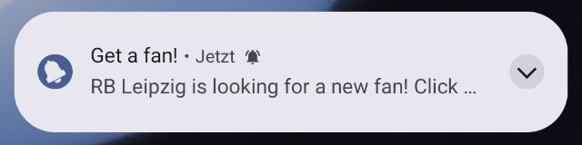


The notification will be automatically unfolded in the notification center if your app presents only one notification. On the lockscreen the notification is always folded.

##### iOS
The visual and audio attachments to display alongside the notification’s main content, see documentation of [UNMutableNotificationContent.attachments](https://developer.apple.com/documentation/usernotifications/unmutablenotificationcontent/attachments).

Support resource patterns:
- `file:///` - Absolute file path
- [res://](#resource-pattern-res) - App resource
- [www](#resource-pattern-www)
- `base64://` - Base64 string

If you attach an image, the image will shown as a small image to the right in the notification and will be expanded when you press long on the notification.

Example folded and unfolded:

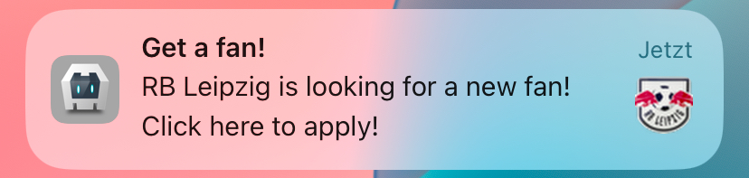


##### Code example

```javascript
cordova.plugins.notification.local.schedule({
    id: 1,
    title: 'Get a fan!',
    text: 'RB Leipzig is looking for a new fan! Click here to apply!',
    attachments: ['www/img/rb-leipzig.png']
});
```

#### Property `badgeNumber`
Default:
- Android: `1` - Each notification increments the badge count by 1
- iOS: `-1` - Does not set any badge

Set the badge count. The behavior differs on Android and iOS.

##### Android
Sets the number of items a notification represents. If the value is `1`, each notification increments the badge of the application by one. If 3 notifications are posted, the badge count will be `3`.

On newer Android versions, the badge count will be presented as a dot and shows the number, if you long press on the app icon.

For using the badge, see the Android documentation [Modify a notification badge](https://developer.android.com/develop/ui/views/notifications/badges).

Calls [NotificationCompat.Builder#setNumber(int)](https://developer.android.com/reference/androidx/core/app/NotificationCompat.Builder#setNumber(int)).

##### iOS
A notification does not increment the badge, it sets the badge count directly. If 3 notifications are posted with the value of `1`, the badge count will be `1` and not `3`.

Specials of this value:
- `-1`: The badge  will not be changed.
- `0`: The badge will be cleared.

Sets [UNMutableNotificationContent#badge](https://developer.apple.com/documentation/usernotifications/unmutablenotificationcontent/badge).

###### Clearing the badge
You can clear the badge with the function [iOSClearBadge](#iosclearbadge).

The badge will also be cleared, if you call `clearAll` or `cancelAll`.

#### Property `id`
Default: `1`

ID of a notification as number. This has to be unique for every notification. If you do not set an ID, it will default to 1. If you use an ID of a previous scheduled notification again, the previous one will be canceled.

#### Property `iOSForeground`
Default: `true`

Displays a notification banner when the app is in foreground, otherwise the notification would only make a noise (sound and vibrate), change the badge, but is not shown as a banner. Since iOS 14, the notification is always displayed in the Notification Center, no matter how this option is set to be consistent with Android. Renamed from `foreground` to `iOSForeground` and changed to `true` by default in Version `1.1.0`.

#### Property `priority`
Default: `0` (=PRIORITY_DEFAULT)

Deprecated since Android 8.

Replaced by [androidChannelImportance](#property-androidchannelimportance), which sets also the [priority](https://developer.android.com/reference/android/app/Notification#priority) value for notifications on Android 7.

This property had aditional functionality for the plugin, which is replaced by [androidAlarmType](#property-androidalarmtype) and [androidAllowWhileIdle](#property-androidallowwhileidle).

##### Old use case
When the value was [PRIORITY_MIN](https://developer.android.com/reference/android/app/Notification#PRIORITY_MIN)(=-2), the alarm was scheduled with [RTC](https://developer.android.com/reference/android/app/AlarmManager#RTC).
This can now be achieved by setting [androidAlarmType](#property-androidalarmtype) to `RTC` and [androidAllowWhileIdle](#property-androidallowwhileidle) to false.

When the value was [PRIORITY_DEFAULT](https://developer.android.com/reference/android/app/Notification#PRIORITY_DEFAULT)(=0), which was set as the default for this plugin, the alarm was scheduled with [RTC_WAKEUP](https://developer.android.com/reference/android/app/AlarmManager#RTC_WAKEUP). This can now be set by [androidAlarmType](#property-androidalarmtype).

When the value was [PRIORITY_MAX](https://developer.android.com/reference/android/app/Notification#PRIORITY_MAX)(=2), the alarm was scheduled by [AlarmManager.setAndAllowWhileIdle](https://developer.android.com/reference/android/app/AlarmManager#setAndAllowWhileIdle(int,%20long,%20android.app.PendingIntent)) or [AlarmManager.setExactAndAllowWhileIdle](https://developer.android.com/reference/android/app/AlarmManager#setExactAndAllowWhileIdle(int,%20long,%20android.app.PendingIntent)). This can now be set by [androidAllowWhileIdle](#property-androidallowwhileidle).

#### Property `sound`
Default: `default`

The value `default` sets the system default sound for a notification. The value `null` will disable the sound.
On Android it sets the sound of a notification channel. On iOS it enables/disables also the vibration.

Example:
- `res://mySound.wav` - Resource from the app bundle, see [documentation](#resource-pattern-res)
- `shared://mySound.wav` - Shared folder, see [documentation](#resource-pattern-shared), Android only
- `www/mySound.wav` - [Documentation](#resource-pattern-file)

##### Android
Before Android 8 it sets the sound of a notification. Since Android 8 it sets the sound of a [notification channel](#notification-channels).

##### iOS
Enables/disables also the vibration. If no sound is set, no vibration will occur.

You can package the audio data in an `aiff`, `wav`, or `caf` file. Sound files must be less than 30 seconds in length.
If the sound file is longer than 30 seconds, the system plays the default sound instead. See [UNNotificationSound - Prepare Sound Resources](https://developer.apple.com/documentation/usernotifications/unnotificationsound?language=objc#Prepare-Sound-Resources).

The system looks in the following folders for the file:
- The `/Library/Sounds` directory of the app’s container directory.
- The `/Library/Sounds` directory of one of the app’s shared group container directories.
- The main bundle of the current executable.

See documentation [UNNotificationSound#soundNamed](https://developer.apple.com/documentation/usernotifications/unnotificationsound/init(named:)?language=objc#Discussion).

### Resource resolving

If a property can take a resource, the following patterns could be used. Not all patterns are available for every property.

#### Resource pattern `file://`
Example: `file://myImage.png`

Looks for a file in the `www` folder. `file://myImage.png` is equivalent to `www/myImage.png`.

#### Resource pattern `www/`
Example: `www/myImage.png`

Looks for a file in the `www` folder.

#### Resource pattern `res://`
Example: `res://myImage.png`

Defines a resource for Android or iOS. In Android it looks in the app's `res` folder, in iOS it looks for a file in the root of the app package.

##### Android
Gets a resource from the `res` directory of your app or the system resources. Normally, when getting a resource file on Android, the resource name should not contain the file extension like `res://myImage`, but, to be compatible with iOS, you can also include the extension like `res://myImage.png`. An explanation what the `res`directory is, can be read in the Android documentation [Providing Resources](https://developer.android.com/guide/topics/resources/providing-resources).

The property, which you use, defines, in which subfolder of `res` the resource should be:
- For a graphic: `drawable` and `mipmap`
- For a sound: `raw`

The plugin trys first to get the resource from you app package, if it does not find one there, it trys to get it from the [system resources](https://developer.android.com/reference/android/content/res/Resources#getSystem()).

If you want to use a system resource, you have to use a valid resource identifier, which you can look for in [Android Code Search](https://cs.android.com/android/platform/superproject/main/+/main:frameworks/base/core/res/res/). An example would be [ic_popup_reminder](https://cs.android.com/android/platform/superproject/main/+/main:frameworks/base/core/res/res/drawable-mdpi/ic_popup_reminder.png), which you would set with `res://ic_popup_reminder`.

To make files files available in the `res` directory, you can use the [resource-file](https://cordova.apache.org/docs/en/12.x/config_ref/#resource-file) tag in `config.xml` like:

```xml
<platform name="android">
    <resource-file src="res/drawable/myImage.png" target="app/src/main/res/drawable/myImage.png" />
    <resource-file src="res/raw/mySound.wav" target="app/src/main/res/raw/mySound.wav" />
</platform>
``` 

The directory structure for this example would be:
```
|- res
   |- drawable
       |- myImage.png 
   |- raw
       |- mySound.wav
|- config.xml
|- plugins
|- platforms
...
```

##### iOS
Looks for a file in the root of the app package.

For e.g.:
`res://AppIcon60x60@3x.png` would point to `YourApp.ipa/AppIcon60x60@3x.png` on a release build or `YourApp.app/AppIcon60x60@3x.png` on a debug build. The app container is a zip file. On a mac, you can right click on your app container and choose `Show package contents`.

To copy files to the app bundle, use the [resource-file](https://cordova.apache.org/docs/en/12.x/config_ref/#resource-file) tag in your `config.xml` like:

```xml
<platform name="ios">
    <resource-file src="res/myAudio.wav" target="myAudio.wav" />
</platform>
```

The directory structure for the example would be:
```
|- res
   |- myAudio.wav
|- config.xml
|- plugins
|- platforms
...
```

#### Resource pattern `shared://`
Example: `shared://myImage.png`

Android only.

##### Android
A shared file in `[Installed-App-Path]/files/shared_files`. This is necessary to get useable Uris for asset files, which are the files of the `www` directory. You can also use the `shared_files` directory, to store files created on runtime. To access the directory, you can use [cordova.file.dataDirectory](https://github.com/apache/cordova-plugin-file#where-to-store-files) of the plugin [cordova-plugin-file](https://github.com/apache/cordova-plugin-file) and write to the folder `shared_files`. The folder `shared_files` will be created on plugin initialization.

## Contributing

1. Fork it
2. Create your feature branch (`git checkout -b my-new-feature`)
3. Commit your changes (`git commit -am 'Add some feature'`)
4. Push to the branch (`git push origin my-new-feature`)
5. Create new Pull Request

## License

This software is released under the [Apache 2.0 License][apache2_license].

Made with :yum: from Leipzig and since 2024 from Cuxhaven

© 2013-2023 [appPlant GmbH][appplant]
<br>© 2024-2025 [Manuel Beck](https://manuelbeck.software)


[ticket_template]: https://github.com/katzer/cordova-plugin-local-notifications/issues/1188
[cordova]: https://cordova.apache.org
[CLI]: http://cordova.apache.org/docs/en/edge/guide_cli_index.md.html#The%20Command-line%20Interface
[npm]: https://www.npmjs.com/package/cordova-plugin-local-notification
[apache2_license]: http://opensource.org/licenses/Apache-2.0
[appplant]: http://appplant.de
