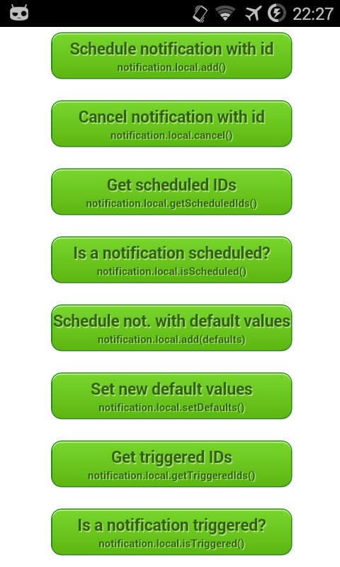

Cordova Local-Notification Plugin - Example
==============================

[Cordova][cordova] plugin to enable an application to inform its users about something, when the application isn’t running in the foreground. Works on various mobile platforms including iOS, Android and Windows Phone. (The Example App currently only supports android. Other Platforms will be added soon.)

## Instructions
[Download][zip] or clone the _example_ branch and run the following command:

```bash
cordova run [android]
```

These will lunch the simulator or any plugged in device and start the example application as seen below in the screenshots. It's also possible to open the project with [Android Studio][studio] or [Eclipse][eclipse].

<p align="center">
    </img>
</p>

Scroll down to see more Buttons.

<p align="center">
    </img>
</p>

Pushing the _"Schedule local notification"_ Button will schedule a local notification wich should be displayed immediately.

This also invokes the declared onAdd (_notification.local.onadd_) and onTrigger (_notification.local.ontrigger_) functions. 

Feel free to use the example and modify it for your own application.

Please read the plugin's [README][readme] for further requirements and informations.


## Screenshots

<p align="center">
    </img>
</p>


## License

This software is released under the [Apache 2.0 License][apache2_license].

© 2013-2014 appPlant UG, Inc. All rights reserved


[cordova]: https://cordova.apache.org
[readme]: https://github.com/katzer/cordova-plugin-local-notifications/blob/master/README.md
[zip]: https://github.com/katzer/cordova-plugin-local-notifications/archive/example.zip
[xcode]: https://developer.apple.com/xcode/
[studio]: https://developer.android.com/sdk/installing/studio.html
[eclipse]: https://developer.android.com/sdk/index.html
[apache2_license]: http://opensource.org/licenses/Apache-2.0

