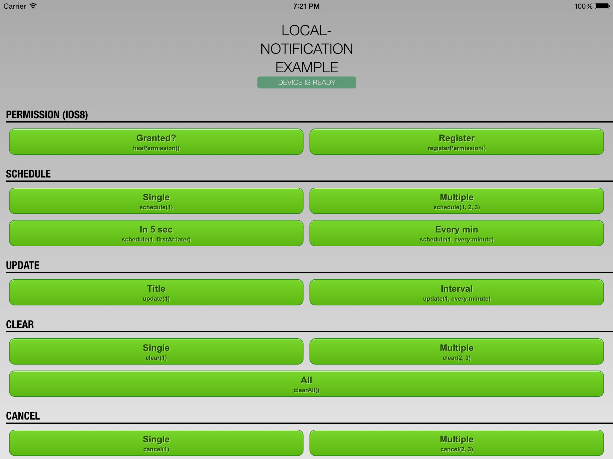
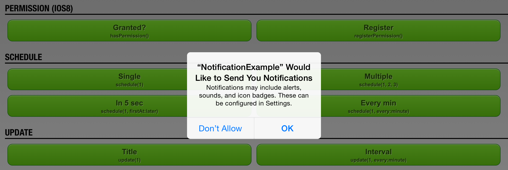
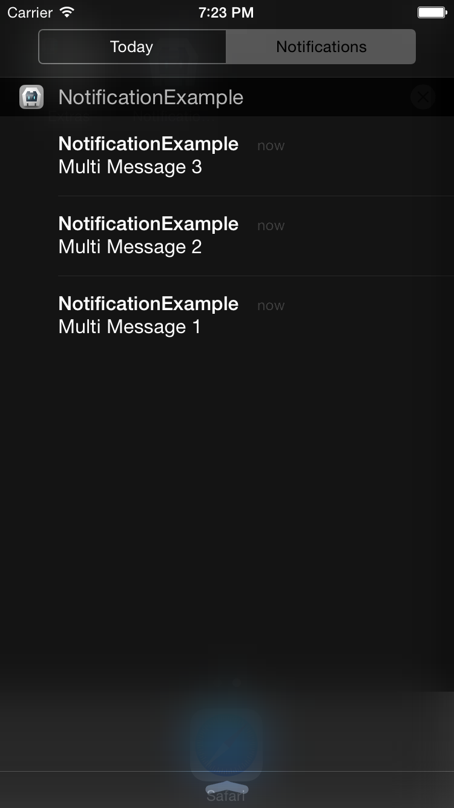
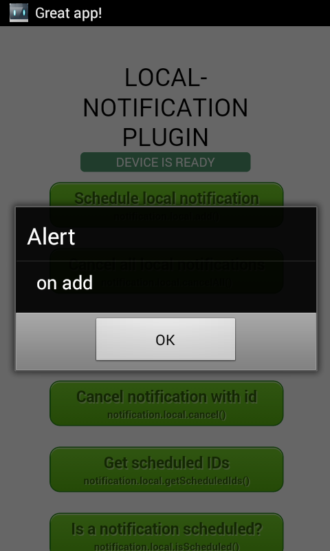

[](https://www.paypal.com/cgi-bin/webscr?cmd=_s-xclick&hosted_button_id=L3HKQCD9UA35A "Donate once-off to this project using Paypal")

Cordova Local-Notification - Example
====================================

[Cordova][cordova] plugin to enable an app that isn’t running in the foreground to let its users know it has information for them. The information could be a message, an impending calendar event, or new data on a remote server. They can display an alert message or they can badge the app icon. They can also play a sound when the alert or badge number is shown.

## Instructions
[Download][zip] or clone the _example_ branch and run the following command:

```bash
cordova run [ios|android|windows]
```

These will lunch the simulator or any plugged in device and start the example application as seen below in the screenshots.<br/>
Its also possible to open and debug the project with [Xcode][xcode], [VS Express for Windows][vsexpress], [Android Studio][studio] or [Eclipse][eclipse].

<p align="center">
    </img>
</p>

Scroll down to see more buttons!

The following code snippet will schedule a local notification every day wich will be displayed within the notification center.

```javascript
cordova.plugins.notification.local.schedule({
    id: 1,
    text: 'My first notification',
    sound: isAndroid ? 'file://sound.mp3' : 'file://beep.caf',
    every: 'day',
    firstAt: next_monday,
    data: { key:'value' }
})
```

This also fires various callbacks like _trigger_ or _click_ for which you can listen as follows:

```javascript
cordova.plugins.notification.local.on('trigger', function (notification) {
    showToast('triggered: ' + notification.id);
}, this);

cordova.plugins.notification.local.on('click', function (notification) {
    showToast('clicked: ' + notification.id);
}, this);
```

Please read the plugin's [README][readme] for further requirements and informations.


### iOS8 Permission
Since iOS8 to use of local noficiations the user has to grant the permission before trying to schedule them. When trying to schedule a notification for the first time, a special system dialog will popup.

Note that iOS will only prompt the user only once! Later the user needs to configure the settings manually.

<p align="center">
    </img>
</p>

## Screenshots
The following screenshots give an overview of how the notification center on each mobile platform does look like when scheduling multiple local notifications at once.

<p align="center">
    </img>
    &nbsp;
    </img>
    &nbsp;
    </img>
</p>


## How can I support the further development?
Your support is needed. If you use the plugin please send us a drop through the donation button.

Thank you!

[](https://www.paypal.com/cgi-bin/webscr?cmd=_s-xclick&hosted_button_id=L3HKQCD9UA35A "Donate once-off to this project using Paypal")


## License

This software is released under the [Apache 2.0 License][apache2_license].

© 2013-2015 appPlant UG, Inc. All rights reserved


[cordova]: https://cordova.apache.org
[readme]: https://github.com/katzer/cordova-plugin-local-notifications/blob/master/README.md
[zip]: https://github.com/katzer/cordova-plugin-local-notifications/archive/example.zip
[xcode]: https://developer.apple.com/xcode/
[vsexpress]: https://www.visualstudio.com/en-us/products/visual-studio-express-vs.aspx
[studio]: https://developer.android.com/sdk/installing/studio.html
[eclipse]: https://developer.android.com/sdk/index.html
[apache2_license]: http://opensource.org/licenses/Apache-2.0

