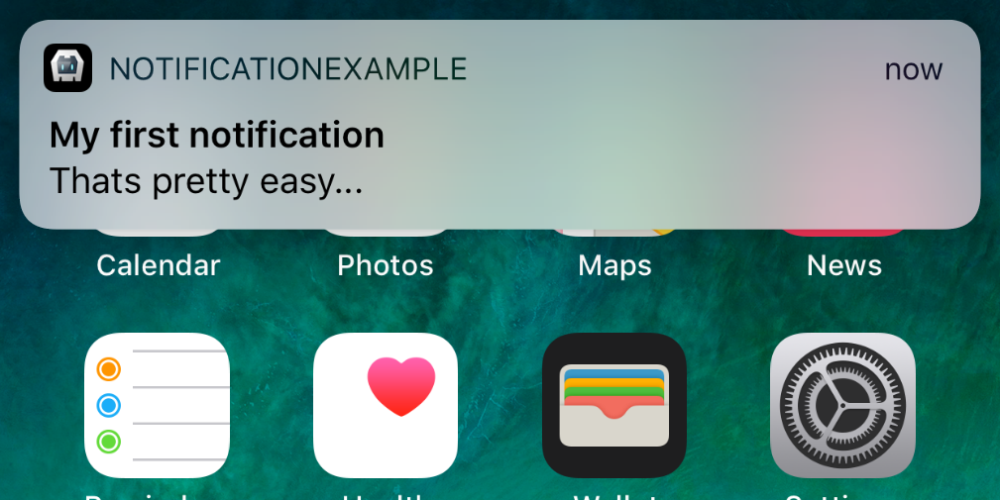

<p align="left"><b><a href="https://github.com/katzer/cordova-plugin-local-notifications/tree/example-x">SAMPLE APP</a> :point_right:</b></p>

<p align="center">
    
</p>

<p align="center">
    <a href="https://www.npmjs.com/package/cordova-plugin-local-notification">
        
    </a>
    <a href="https://opensource.org/licenses/Apache-2.0">
        
    </a>
</p>

<br>

> A notification is a message you display to the user outside of your app's normal UI. When you tell the system to issue a notification, it first appears as an icon in the notification area. To see the details of the notification, the user opens the notification drawer. Both the notification area and the notification drawer are system-controlled areas that the user can view at any time.

<br>

</img>
</img>

### Notification components

- Header area
- Content area
- Action area

### How notifications may be noticed

- Showing a status bar icon
- Appearing on the lock screen
- Playing a sound or vibrating
- Peeking onto the current screen
- Blinking the device's LED

### Supported platforms

- Android 7.0+
- iOS 10+

<br>
<br>

## Important Notice

Please make sure that you always read the tagged README for the version you're using.

Please report bugs or missing features.

## Basics

The plugin creates the object `cordova.plugins.notification.local` and is accessible after *deviceready* has been fired.

```js
cordova.plugins.notification.local.schedule({
    title: 'My first notification',
    text: 'Thats pretty easy...',
    foreground: true
});
```

<p align="center">
    
</p>

The plugin allows to schedule multiple notifications at once.

```js
cordova.plugins.notification.local.schedule([
    { id: 1, title: 'My first notification' },
    { id: 2, title: 'My first notification' }
]);
```

## Properties

A notification does have a set of configurable properties.

<b>Not all of them are supported across all platforms.</b>

<i>The table is not complete regarding the support.</i>


| Property      | Android | iOS | Comment                   |
| :------------ | :-------| :-- | :------------------------ |
| actions       |         |     |                           |
| attachments   |         |     |                           |
| autoClear     |         |     |                           |
| badge         |         |     |                           |
| channelId       |       x | -   |  Android only. Set the `channelId` for the notification to be posted on. See [Android Notification Channels](#android-notification-channels) for more information. |
| clock         |         |     |                           |
| color         |         |     |                           |
| data          |         |     |                           |
| defaults      |         |     |                           |
| foreground    |         |     |                           |
| group         |         |     |                           |
| groupSummary  |         |     |                           |
| icon          |         |     |                           |
| iconType      |         |     |                           |
| id            |         |     |                           |
| launch        |         |     |                           |
| led           |         |     |                           |
| lockscreen    |         |     |                           |
| mediaSession  |         |     |                           |
| number        |         |     |                           |
| onlyAlertOnce | x       | -   |  Android only. Set this flag if you would only like the sound, vibrate and ticker to be played if the notification is not already showing (see [documentation](https://developer.android.com/reference/android/app/Notification.Builder#setOnlyAlertOnce(boolean))). |
| priority      |         |     |                           |
| progressBar   | x       | -   | Natively not supported by iOS, [see Stackoverflow](https://stackoverflow.com/questions/48500532/progress-view-in-local-notification/48500734#48500734) |
| silent        |         |     |                           |
| smallIcon     |         |     |                           |
| sound         | (x)     | (x) | On Android, it sets the sound file until Android 7.1. Since Android 8 it must be set by a channel. In iOS it would be possible, but it is not implemented. |
| sticky        |         |     |                           |
| summary       |         |     |                           |
| text          | x       | x   | Text of the notification. For Android exists some special features: 1. It can be a JSONArray to [summarize](#summarizing) notifications. [NotificationCompat.MessagingStyle](https://developer.android.com/reference/androidx/core/app/NotificationCompat.MessagingStyle) will then be used. Using an JSONArray for iOS would result in a crash. 2. If the text contains line breaks (`\n`) the notification style [NotificationCompat.InboxStyle](https://developer.android.com/reference/androidx/core/app/NotificationCompat.InboxStyle) would be used. 3. If the text is longer then 44 chars, the notifications style [NotificationCompat.BigTextStyle](https://developer.android.com/reference/androidx/core/app/NotificationCompat.BigTextStyle) will be used. |
| timeoutAfter  |         |     |                           |
| title         |         |     |                           |
| trigger       |         |     |                           |
| vibrate       | (x)     |    -|  Android only. Since Android 8 it must be set with a channel. |
| wakeup        |         |     |                           |

For their default values see:

```js
cordova.plugins.notification.local.getDefaults();
```

To change some default values:

```js
cordova.plugins.notification.local.setDefaults({
    led: { color: '#FF00FF', on: 500, off: 500 },
    vibrate: false
});
```

## Actions

The plugin knows two types of actions: _button_ and _input_.

```js
cordova.plugins.notification.local.schedule({
    title: 'The big survey',
    text: 'Are you a fan of RB Leipzig?',
    attachments: ['file://img/rb-leipzig.jpg'],
    actions: [
        { id: 'yes', title: 'Yes' },
        { id: 'no',  title: 'No' }
    ]
});
```

<p align="center">
    
    &nbsp;&nbsp;&nbsp;&nbsp;
    
</p>

Icons on action buttons are not displayed anymore since Android 7, [see documentation](https://developer.android.com/reference/android/app/Notification.Action.Builder#Builder(int,%20java.lang.CharSequence,%20android.app.PendingIntent))

### Input

```js
cordova.plugins.notification.local.schedule({
    title: 'Justin Rhyss',
    text: 'Do you want to go see a movie tonight?',
    actions: [{
        id: 'reply',
        type: 'input',
        title: 'Reply',
        emptyText: 'Type message',
    }, ... ]
});
```

<p align="center">
    
</p>

It is recommended to pre-define action groups rather then specifying them with each new notification of the same type.


```js
cordova.plugins.notification.local.addActions('yes-no', [
    { id: 'yes', title: 'Yes' },
    { id: 'no',  title: 'No'  }
]);
```

Once you have defined an action group, you can reference it when scheduling notifications:

```js
cordova.plugins.notification.local.schedule({
    title: 'Justin Rhyss',
    text: 'Do you want to go see a movie tonight?',
    actions: 'yes-no'
});
```

### Properties

Actions do have a set of configurable properties. Not all of them are supported across all platforms.

| Property     | Type         | Android | iOS |
| :----------- | :----------- | :------ | :-- |
| id           | button+input | x       | x   |
| title        | button+input | x       | x   |
| launch       | button+input | x       | x   |
| ui           | button+input |         | x   |
| needsAuth    | button+input |         | x   |
| icon         | button+input | x       |     |
| emptyText    | input        | x       | x   |
| submitTitle  | input        |         | x   |
| editable     | input        | x       |     |
| choices      | input        | x       |     |
| defaultValue | input        |         |     |


## Triggers

Notifications may trigger immediately or depend on calendar or location.

To trigger at a fix date:

```js
cordova.plugins.notification.local.schedule({
    title: 'Design team meeting',
    text: '3:00 - 4:00 PM',
    trigger: { at: new Date(2017, 10, 27, 15) }
});
```

Or relative from now:

```js
cordova.plugins.notification.local.schedule({
    title: 'Design team meeting',
    trigger: { in: 1, unit: 'hour' }
});
```

### Repeating

Repeat relative from now:

```js
cordova.plugins.notification.local.schedule({
    title: 'Design team meeting',
    trigger: { every: 'day', count: 5 }
});
```

Or trigger every time the date matches:

```js
cordova.plugins.notification.local.schedule({
    title: 'Happy Birthday!!!',
    trigger: { every: { month: 10, day: 27, hour: 9, minute: 0 } }
});
```

### Location based

To trigger when the user enters a region:

```js
cordova.plugins.notification.local.schedule({
    title: 'Welcome to our office',
    trigger: {
        type: 'location',
        center: [x, y],
        radius: 15,
        notifyOnEntry: true
    }
});
```

### Properties

The properties depend on the trigger type. Not all of them are supported across all platforms.

| Type         | Property      | Type    | Value            | Android | iOS |
| :----------- | :------------ | :------ | :--------------- | :------ | :-- |
| Fix          |
|              | at            | Date    |                  | x       | x   |
| Timespan     |
|              | in            | Int     |                  | x       | x   |
|              | unit          | String  | `second`         | x       | x   |
|              | unit          | String  | `minute`         | x       | x   |
|              | unit          | String  | `hour`           | x       | x   |
|              | unit          | String  | `day`            | x       | x   |
|              | unit          | String  | `week`           | x       | x   |
|              | unit          | String  | `month`          | x       | x   |
|              | unit          | String  | `quarter`        | x       | x   |
|              | unit          | String  | `year`           | x       | x   |
| Repeat       |
|              | count         | Int     |                  | x       |     |
|              | every         | String  | `minute`         | x       | x   |
|              | every         | String  | `hour`           | x       | x   |
|              | every         | String  | `day`            | x       | x   |
|              | every         | String  | `week`           | x       | x   |
|              | every         | String  | `month`          | x       | x   |
|              | every         | String  | `quarter`        | x       |     |
|              | every         | String  | `year`           | x       | x   |
|              | before        | Date    |                  | x       |     |
|              | firstAt       | Date    |                  | x       |     |
| Match        |
|              | count         | Int     |                  | x       |     |
|              | every         | Object  | `minute`         | x       | x   |
|              | every         | Object  | `hour`           | x       | x   |
|              | every         | Object  | `day`            | x       | x   |
|              | every         | Object  | `weekday`        | x       | x   |
|              | every         | Object  | `weekdayOrdinal` |         | x   |
|              | every         | Object  | `week`           |         | x   |
|              | every         | Object  | `weekOfMonth`    | x       | x   |
|              | every         | Object  | `month`          | x       | x   |
|              | every         | Object  | `quarter`        |         | x   |
|              | every         | Object  | `year`           | x       | x   |
|              | before        | Date    |                  | x       |     |
|              | after         | Date    |                  | x       |     |
| Location     |
|              | center        | Array   | `[lat, long]`    |         | x   |
|              | radius        | Int     |                  |         | x   |
|              | notifyOnEntry | Boolean |                  |         | x   |
|              | notifyOnExit  | Boolean |                  |         | x   |
|              | single        | Boolean |                  |         | x   |


## Progress

Notifications can include an animated progress indicator that shows users the status of an ongoing operation. Android only.

```js
cordova.plugins.notification.local.schedule({
    title: 'Sync in progress',
    text: 'Copied 2 of 10 files',
    progressBar: { value: 20 }
});
```

<p align="center">
    
</p>


## Patterns

Split the text by line breaks if the message comes from a single person and just too long to show in a single line.

```js
cordova.plugins.notification.local.schedule({
    title: 'The Big Meeting',
    text: '4:15 - 5:15 PM\nBig Conference Room',
    smallIcon: 'res://calendar',
    icon: 'https://encrypted-tbn0.gstatic.com/images?q=tbn:ANd9GcTzfXKe6Yfjr6rCtR6cMPJB8CqMAYWECDtDqH-eMnerHHuXv9egrw'
});
```

<p align="center">
    
</p>

### Summarizing

Instead of displaying multiple notifications, you can create one notification that summarizes them all.

```js
cordova.plugins.notification.local.schedule({
    id: 15,
    title: 'Chat with Irish',
    icon: 'http://climberindonesia.com/assets/icon/ionicons-2.0.1/png/512/android-chat.png',
    text: [
        { message: 'I miss you' },
        { person: 'Irish', message: 'I miss you more!' },
        { message: 'I always miss you more by 10%' }
    ]
});
```

<p align="center">
    
</p>

To add a new message to the existing chat:

```js
cordova.plugins.notification.local.update({
    id: 15,
    text: [{ person: 'Irish', message: 'Bye bye' }]
});
```

### Grouping

Your app can present multiple notifications as a single group:

- A parent notification displays a summary of its child notifications.
- The child notifications are presented without duplicate header information.

```js
cordova.plugins.notification.local.schedule([
    { id: 0, title: 'Design team meeting', ... },
    { id: 1, summary: 'me@gmail.com', group: 'email', groupSummary: true },
    { id: 2, title: 'Please take all my money', ... group: 'email' },
    { id: 3, title: 'A question regarding this plugin', ... group: 'email' },
    { id: 4, title: 'Wellcome back home', ... group: 'email' }
]);
```

<p align="center">
    
</p>


## Permissions

Each platform may require the user to grant permissions first before the app is allowed to schedule notifications.

```js
cordova.plugins.notification.local.hasPermission(function (granted) { ... });
```

If requesting via plug-in, a system dialog does pop up for the first time. Later its only possible to tweak the settings through the system settings.

```js
cordova.plugins.notification.local.requestPermission(function (granted) { ... });
```

<p align="center">
    
</p>

Checking the permissions is done automatically, however it's possible to skip that.

```js
cordova.plugins.notification.local.schedule(toast, callback, scope, { skipPermission: true });
```


## Events

The following events are supported: `add`, `trigger`, `click`, `clear`, `cancel`, `update`, `clearall` and `cancelall`.

```js
cordova.plugins.notification.local.on(event, callback, scope);
```

To unsubscribe from events:

```js
cordova.plugins.notification.local.un(event, callback, scope);
```

__Note:__ You have to provide the exact same callback to `cordova.plugins.notification.local.un` as you provided to `cordova.plugins.notification.local.on` to make unsubscribing work.
Hence you should define your callback as a separate function, not inline. If you want to use `this` inside of your callback, you also have to provide `this` as `scope` to `cordova.plugins.notification.local.on`.

### Custom

The plugin also fires events specified by actions.

```js
cordova.plugins.notification.local.schedule({
    title: 'Do you want to go see a movie tonight?',
    actions: [{ id: 'yes', title: 'Yes' }]
});
```

The name of the event is the id of the action.

```js
cordova.plugins.notification.local.on('yes', function (notification, eopts) { ... });
```

### Fire manually

Not an official interface, however its possible to manually fire events.

```js
cordova.plugins.notification.local.core.fireEvent(event, args);
```


## Launch Details

Check the `launchDetails` to find out if the app was launched by clicking on a notification.

```js
document.addEventListener('deviceready', function () {
    console.log(cordova.plugins.notification.local.launchDetails);
}, false);
```

It might be possible that the underlying framework like __Ionic__ is not compatible with the launch process defined by cordova. With the result that the plugin fires the click event on app start before the app is able to listen for the events.

Therefore its possible to fire the queued events manually by defining a global variable.

```js
window.skipLocalNotificationReady = true
```

Once the app and Ionic is ready, you can fire the queued events manually.

```js
cordova.plugins.notification.local.fireQueuedEvents();
```


## Methods

All methods work asynchronous and accept callback methods.
See the sample app for how to use them.

| Method                         | Android | iOS | Comment                   |
| :------------------------------| :-------| :-- | :------------------------ |
| addActions                     |         |     |                           |
| cancel                         | x       | x   |                           |
| cancelAll                      | x       | x   |                           |
| canScheduleExactAlarms         | x       | -   | Android only. Checks if exact alarms are permitted. Since Android 13 inexact alarms are permitted by default. |
| clear                          | x       | x   | On Android, it clears a already posted notification from the statusbar. |
| clearAll                       | x       | x   |                           |
| createChannel                  | x       | -   | Android only. Creates a channel for Android to post notifications on. |
| fireQueuedEvents               |         |     |                           |
| get                            |         |     |                           |
| getAll                         |         |     |                           |
| getDefaults                    |         |     |                           |
| getIds                         |         |     |                           |
| getScheduled                   |         |     |                           |
| getScheduledIds                |         |     |                           |
| getTriggered                   |         |     |                           |
| getTriggeredIds                |         |     |                           |
| getType                        |         |     |                           |
| hasActions                     |         |     |                           |
| hasPermission                  |         |     |                           |
| isPresent                      |         |     |                           |
| isScheduled                    |         |     |                           |
| isTriggered                    |         |     |                           |
| on                             |         |     |                           |
| openAlarmSettings              | x       | -   | Android only. Supported since Android 12. Opens the "Alarms & Reminders"-settings, where the user can manually enable exact alarms. |
| openNotificationSettings       | x       | (x) | Opens the notifications settings since Android 8. On iOS it opens the app settings. |
| removeActions                  |         |     |                           |
| requestPermission              |         |     |                           |
| schedule                       |         |     |                           |
| setDefaults                    |         |     |                           |
| un                             |         |     |                           |
| update                         |         |     |                           |

### Android exact/inexact Alarms
Since Android 13 notifications will be scheduled inexact by default. The user must grant exact alarm permissions manually in the "Alarms & Reminders"-setting by [openAlarmSettings](#openalarmsettings), if exact alarms are required.

#### openAlarmSettings
Opens the "Alarms & Reminders"-settings as an Activity when running on Android 12 (SDK 31) or later, where the user can enable exact alarms. On Android older then 12, it will just call the `successCallback`, without doing anything. This method will not wait for the user to be returned back to the app. For this, the `resume`-event can be used. The callback will just return `OK`, after starting the activity.
- If the user grants permission, already inexact scheduled notifications will automatically be rescheduled as exact alarms, but only if the app is still available in background.
- If exact alarms were already granted and the user revokes it, the app will be killed and all scheduled notifications will be canceld. The app have to schedule the notifications as inexact alarms again, when the app is opened the next time, see https://developer.android.com/develop/background-work/services/alarms/schedule#using-schedule-exact-permission.

#### canScheduleExactAlarms
Checks if the user has enabled the "Alarms & Reminders"-setting. If not, the notificiatons will be scheduled inexact, which is still ok and will only be delayed by some minutes.
- On Android 12 the permission is granted by default
- On Android 13 and newer, the permission is not granted by default and have to be explicitly enabled by the user.
- On Android 11 and older, this method will always return `true` in the `successCallback`.

#### openNotificationSettings
Opens the notifications settings of the app on Android 8 and newer. This method will not wait for the user to be returned back to the app. For this, the `resume`-event can be used.
- On Android, the callback will just return "OK", after starting the activity.
- On Android older then 8, it opens the app details.
- On iOS it's not possible to open the notification settings, it will open the app settings.

## Android Notification Channels
Since Android 8 notification channels must be created to post noitifications. The settings for the vibration, sound and importance is set by a channel and not by a notification. A channel is not changeable, after it is created. This is a restriction by Android.

### Default Channel
A default channel will always be created by this plugin and has the following settings:
- ID: `default-channel-id`
- Name: `Default channel`
- [IMPORTANCE_DEFAULT](https://developer.android.com/reference/android/app/NotificationManager#IMPORTANCE_DEFAULT)

The values of the default channel are not configurable at this point. Any notification that doesn't specify a `channelId` property will use this default channel with default sound and vibration settings.

The creation of a channel is done as follows: 

```js
cordova.plugins.notification.local.createChannel({
    channelId:'my_ch_id', // string - To separate something in the id, use "_" instead of "-"
    channelName:'My Channel Name', // string 
    description:"Description of channel", // string (optional)
    sound: 'file://audio/ring.mp3', // string (optional) 
    vibrate: true, // bool (optional), default is false
    importance: 3, // int (optional) 0 to 4, default is IMPORTANCE_DEFAULT (3)
    soundUsage: 5, // int (optional), default is USAGE_NOTIFICATION
  }, success_callback, this)
```

For setting the channel, use the `channelId` property when scheduling a notification.

**Options for `importance`** [Documentation](https://developer.android.com/reference/android/app/NotificationChannel#NotificationChannel(java.lang.String,%20java.lang.CharSequence,%20int))  
0 IMPORTANCE_NONE  
1 IMPORTANCE_MIN  
2 IMPORTANCE_LOW  
3 IMPORTANCE_DEFAULT  
4 IMPORTANCE_HIGH  

**Options for `soundUsage`** [Documentation](https://developer.android.com/reference/android/media/AudioAttributes.Builder#setUsage(int))  
0: USAGE_UNKNOWN  
1: USAGE_MEDIA  
2: USAGE_VOICE_COMMUNICATION  
3: USAGE_VOICE_COMMUNICATION_SIGNALLING  
4: USAGE_ALARM  
5: USAGE_NOTIFICATION  
6: USAGE_NOTIFICATION_RINGTONE  
7: USAGE_NOTIFICATION_COMMUNICATION_REQUEST  
8: USAGE_NOTIFICATION_COMMUNICATION_INSTANT  
9: USAGE_NOTIFICATION_COMMUNICATION_DELAYED  
10: USAGE_NOTIFICATION_EVENT  
11: USAGE_ASSISTANCE_ACCESSIBILITY  
12: USAGE_ASSISTANCE_NAVIGATION_GUIDANCE  
13: USAGE_ASSISTANCE_SONIFICATION  
14: USAGE_GAME  
16: USAGE_ASSISTANT

## Installation

The plugin can be installed via [Cordova-CLI][CLI] and is publicly available on [NPM][npm].

Execute from the projects root folder:

    $ cordova plugin add cordova-plugin-local-notification

Or install a specific version:

    $ cordova plugin add cordova-plugin-local-notification@VERSION

Or install the latest head version:

    $ cordova plugin add https://github.com/katzer/cordova-plugin-local-notifications.git

Or install from local source:

    $ cordova plugin add <path> --nofetch --nosave --link


## Contributing

1. Fork it
2. Create your feature branch (`git checkout -b my-new-feature`)
3. Commit your changes (`git commit -am 'Add some feature'`)
4. Push to the branch (`git push origin my-new-feature`)
5. Create new Pull Request


## License

This software is released under the [Apache 2.0 License][apache2_license].

Made with :yum: from Leipzig and since 2024 from Cuxhaven

© 2013-2023 [appPlant GmbH][appplant]
<br>© 2024 [Manuel Beck](https://manuelbeck.software)


[ticket_template]: https://github.com/katzer/cordova-plugin-local-notifications/issues/1188
[cordova]: https://cordova.apache.org
[CLI]: http://cordova.apache.org/docs/en/edge/guide_cli_index.md.html#The%20Command-line%20Interface
[npm]: https://www.npmjs.com/package/cordova-plugin-local-notification
[apache2_license]: http://opensource.org/licenses/Apache-2.0
[appplant]: http://appplant.de
